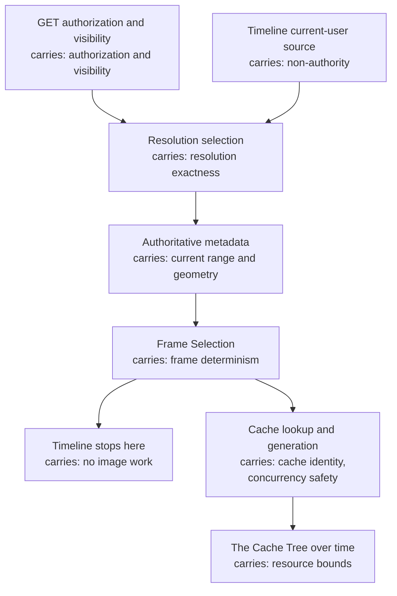

# Design

What the product promises, what breaks without each promise, and why the mechanism
is shaped the way it is. Lifecycle chapters remain the source for mechanism; this layer
links there for the definitive flow, and links to [participants](../participants/README.md)
for ownership boundaries.

Read this layer last. It makes sense once you know what happens, and it is the layer
that answers *why not something else*.

## The guarantee map

| Promise | Chapter | Enforced in | A caller observes it as |
|---|---|---|---|
| A frame reaches only someone who may play it, and an invisible Item does not exist | [Authorization and visibility](authorization-and-visibility.md) | [Source resolution](../lifecycle/source-resolution.md) | `401`, `403`, `404` |
| The width served is one the server was configured to produce, exactly | [Resolution exactness](resolution-exactness.md) | [Source resolution](../lifecycle/source-resolution.md) | `404`, never a substitute |
| Each direct Frame Index identifies one frame, and invalid indexes are rejected | [Frame determinism](frame-determinism.md) | [Frame Selection](../lifecycle/frame-selection.md) | JPEG or `400` |
| Timeline calculation never costs image work, and never promises delivery | [Timeline isolation](timeline-isolation.md) | [Source resolution](../lifecycle/source-resolution.md) | Two-field JSON, no image work |
| Cached bytes keep source identity while metadata is read authoritatively | [Cache identity and freshness](cache-identity-and-freshness.md) | [Source resolution](../lifecycle/source-resolution.md), [Preview Cache Entry](../lifecycle/preview-cache.md) | ETag, `X-Trickplay-Cache` |
| Nobody reads a partial entry, and one frame costs one generation | [Concurrency safety](concurrency-safety.md) | [Cache coordination](../lifecycle/cache-coordination.md) | `Server-Timing` |
| The Cache Tree stays bounded, and emptying it disturbs nobody | [Resource bounds](resource-bounds.md) | [Scheduled cleanup](../lifecycle/scheduled-cleanup.md) | Nothing — no caller can observe this |

The two stages carrying the most are the shared authorization front, where visibility and
playback authority must remain ordered, and the cache, where identity and coordination are
two promises about the same file. Timeline joins only at calculation and never authorizes a
later Preview.

## Deliberate non-promises

What the product refuses to guarantee is as much a design decision as what it does
guarantee:

- **No nearest resolution.** If the exact Selected Trickplay Resolution has no
  generated metadata, there is no preview. See
  [resolution exactness](resolution-exactness.md).
- **No Timeline-implies-preview.** A successful Timeline says nothing about whether the
  Source Sprite exists. See [Timeline isolation](timeline-isolation.md).
- **No client cache lifetime.** The plugin supplies identity and freshness and
  prescribes no key, expiry, or invalidation rule. See
  [the client](../participants/client.md).
- **No metadata/Source Sprite atomicity guarantee.** Jellyfin may perform independent
  manager-owned reads, so metadata and pixels can change between stages. See
  [cache identity and freshness](cache-identity-and-freshness.md).
- **No repair of Jellyfin-owned data.** A wrong, stale, or missing Source Sprite is
  the server's to fix. See [Jellyfin Server](../participants/jellyfin-server.md).
- **No persistence of anything derived.** The whole Cache Tree is reclaimable at any
  time, by the plugin or by the server. See [the Cache Tree](../participants/cache-tree.md).
- **No detection of a sprite replaced mid-request.** The source version is snapshotted
  once and not revalidated across encoding, so a replacement inside that window can be
  served undetected. See
  [cache identity and freshness](cache-identity-and-freshness.md).
- **No content negotiation.** Nothing negotiates type, dimensions, or quality. One
  frame, one format, one quality, and a client that cannot display it still receives
  exactly that.

## How to read a chapter here

Chapters share a core of promise, rationale, enforcement, and caller observation.
Chapters add a failure-mode or bound section when that concern needs its own explanation.
An empty "where it is enforced" would be a defect in the product rather than in the
document, which is what makes the layer auditable.
