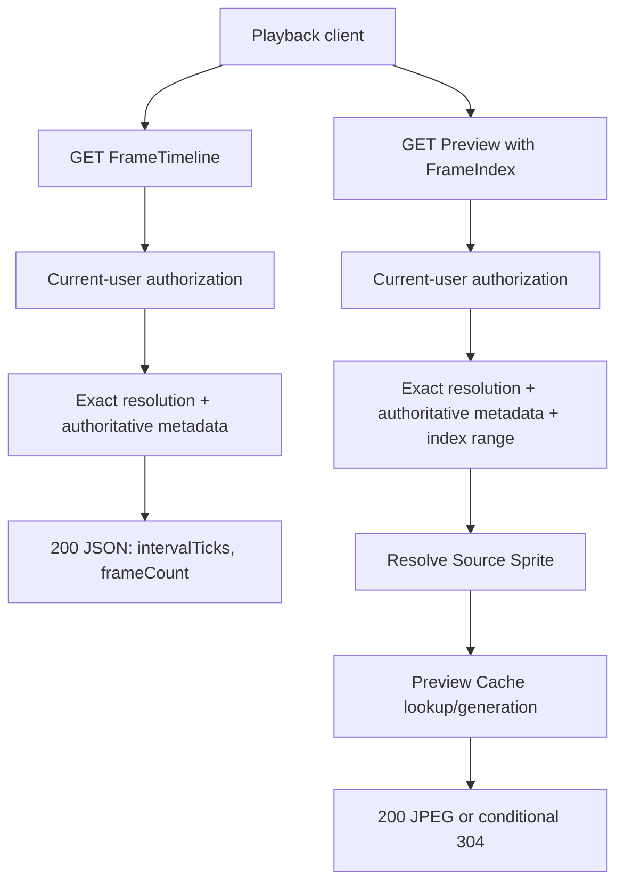

# Lifecycle

What happens, in order, when a request arrives. This is the only layer that describes
mechanism; ownership is in [participants](../participants/README.md), and rationale is in
[design](../design/README.md).

Trickplay Cropper has two authenticated GET operations. A client obtains one Frame Timeline
for a logical Item and Media Source, calculates direct zero-based Frame Index values locally,
then requests each selected Trickplay Preview.

Both operations re-check the current user, logical Item visibility, full playback access,
exact Media Source membership, and Source Video visibility. Timeline reads one authoritative
metadata row and stops before image work. Preview validates the supplied index against the
current frame count before sprite lookup, cache, conditional comparison, or encoding.

## Chapters

| Chapter | What it covers |
|---|---|
| [Source resolution](source-resolution.md) | Authorization, source membership, exact resolution, and authoritative metadata |
| [Frame Selection](frame-selection.md) | Direct Frame Index to Source Sprite cell and crop |
| [Preview generation](preview-generation.md) | Cropping and encoding one frame |
| [Preview Cache Entry](preview-cache.md) | Cache identity, source version, and tree layout |
| [Cache coordination](cache-coordination.md) | Leases, entry locks, buffering, and publication |
| [The response contract](response-contract.md) | Headers, JSON, and status codes |
| [Scheduled cleanup](scheduled-cleanup.md) | Emptying the Cache Tree safely |

The retired Frame Probe, PositionTicks calculation, end clamping, and observation caches are
not part of the current product lifecycle.

## What this layer does not cover

Tests, build, packaging, GitHub Actions, release publication, and the plugin manifest are
development operations. Installation, update, and rollback guidance lives in the repository
README.
