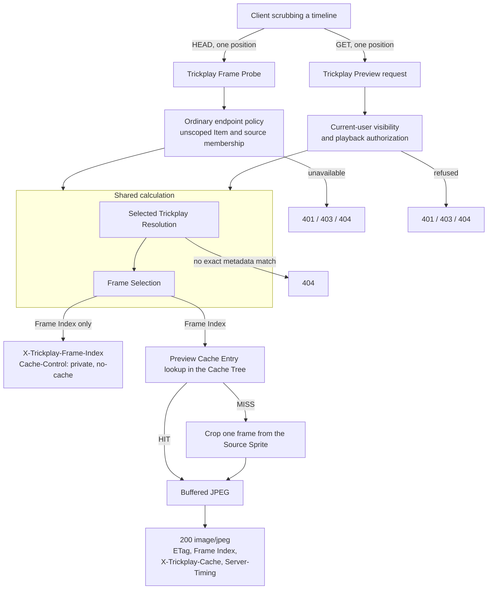

# Lifecycle

What happens, in order, when a request arrives. This is the only layer that describes
mechanism: who owns what is in [the participants layer](../participants/README.md), and
why the rules are shaped this way is in [the design layer](../design/README.md).

Read this layer second, after the participants.

Trickplay Cropper serves one JPEG frame of a video for an authorized playback position,
cropped from trickplay data Jellyfin already generated. Two operations share one
calculation but deliberately use different request fronts:

- The **Trickplay Frame Probe** answers *which frame does this position select?* It reads
  configuration and metadata, computes a Frame Index, and stops. It never touches an image.
- The **Trickplay Preview** request answers *give me that frame.* It first establishes
  the current user's visibility and playback authority, then looks the calculated frame
  up in the Cache Tree and crops it from a Source Sprite if it is not there.

## The lifecycle

The operations converge only for target, metadata, and Frame Index calculation. HEAD
does not establish user visibility or playback authority, while GET must establish both
before it can return bytes or validate an ETag. A successful HEAD is therefore neither
permission evidence nor a promise that GET can serve the frame.

## Chapters, in flow order

| Chapter | What it covers |
|---|---|
| [Source resolution](source-resolution.md) | The separate GET and HEAD request fronts, and from current Trickplay Resolution Targets to one exact Selected Trickplay Resolution |
| [Trickplay Frame Probe](frame-probe.md) | What the HEAD operation may read, what it must never touch, and where it stops |
| [Frame Selection](frame-selection.md) | Playback position to Frame Index, and Frame Index to sprite, cell, row, column, crop |
| [Preview generation](preview-generation.md) | Cropping one frame out of a Source Sprite, and why only part of the sprite is decoded |
| [Preview Cache Entry](preview-cache.md) | The identity inputs, the source version stamp, and the Cache Tree layout |
| [Cache coordination](cache-coordination.md) | Tree leases, entry locks, buffering before release, and the publication race |
| [The response contract](response-contract.md) | Every header and status both operations can produce |
| [Scheduled cleanup](scheduled-cleanup.md) | Emptying the Cache Tree without disturbing a live request |

Each chapter opens by naming the design chapter that owns its rationale, so no rule is
explained in two places.

## What this layer does not cover

Tests, build, packaging, GitHub Actions, Release publication, and the plugin manifest are
development operations, not business logic. Installation, update, and rollback guidance
lives in the repository README.
