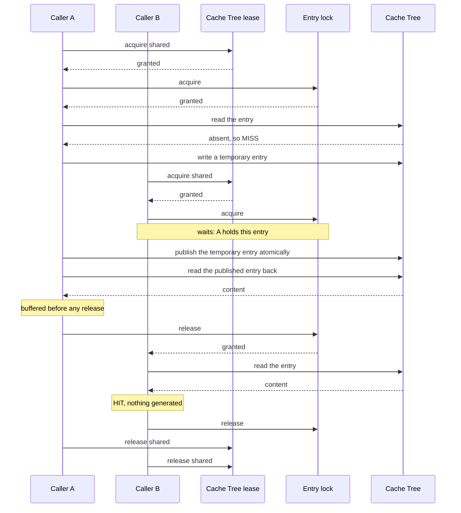
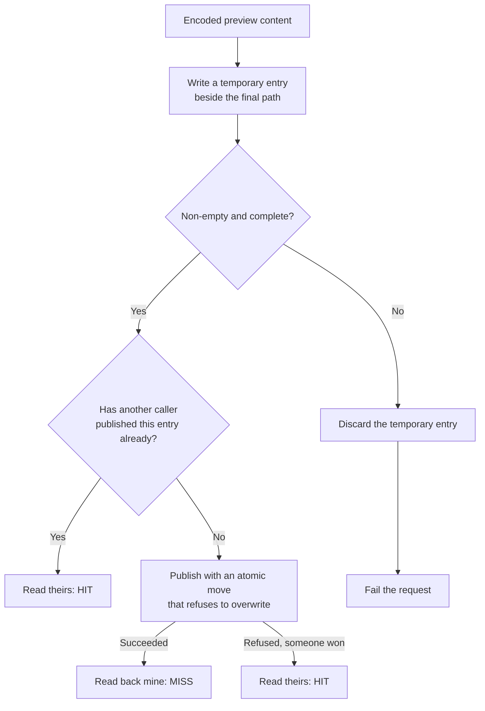

# Cache coordination

_Why the coordination is shaped this way, why it is not global serialization, and what
breaks without it: [Concurrency safety](../design/concurrency-safety.md). This chapter is
the mechanism._

## The setting

One Cache Tree is shared by every concurrent request in the server process, and by the
maintenance run that empties it. Under a scrub storm, many callers ask for frames of the
same video at once: some for the same frame, most for different ones.

## Two locks, one order

**The Cache Tree lease** guards the tree as a whole. Requests take it *shared*, so
they do not wait for each other. Only operations that change the tree's shape —
removing an orphaned temporary entry, pruning an empty directory — take it
*exclusively*. The lease is writer-preferred: once a maintenance operation is
waiting, new requests queue behind it rather than streaming past and starving it.

**The entry lock** guards one Preview Cache Entry, keyed by its path. Callers
asking for different frames take different entry locks and never meet. Only
callers asking for the *same* frame contend, and that contention is the point: it
is what makes the second caller reuse the first caller's work.

Every path through the cache takes them in the same order — tree lease, then entry lock —
and releases them in the reverse order. The order is mandatory on every path, including
the maintenance ones.

Neither lock has a timeout; both waits are cancellable.

## The critical detail: buffer before release

The response content is read into memory **before** either lock is released. The ordering
is not an optimization and is not optional; why releasing first would break a request that
had already succeeded is in
[concurrency safety](../design/concurrency-safety.md).

Caller B waited, and waiting was the correct outcome: it turned a second decode of
the same frame into a read.

## The publication race

Generation does not write directly to the entry path. It writes to a **temporary
entry** beside it, created so that no two writers can share one, then publishes it
with an atomic move that refuses to overwrite.

That refusal is the whole cross-process story, because no in-process lock reaches another
process. Two writers may both generate the same frame: whichever move lands first wins,
the loser's move fails, and the loser **reads the winner's entry and reports a hit**.
Losing is not an error and is not retried.

The temporary entry is always removed, whichever branch ran, so a failed or
cancelled generation does not litter the tree. A temporary entry that survives
anyway — a process killed mid-write — is an orphan, and only the maintenance run
may remove it, under an exclusive tree lease.

## What is observable

A caller sees coordination only through `Server-Timing`, which reports how long the
lookup, cache, decode, and encode stages took. A wait shows up there as time, not
as a named event.

For diagnosis on the server, the waits themselves are observable as one stable
structured Debug protocol. Each event is identified by a fixed EventId and
EventName, carries only non-sensitive correlation and result fields, and is
redaction-safe: no tokens, claims, user names, titles, media paths, Source Sprite
paths, or Cache Tree paths ever appear.

| EventId | EventName | Reports |
|---|---|---|
| 1001 | `TrickplayPreviewUnavailable` | One expected `404` outcome, with a stable reason: `NoConfiguredTarget`, `NoGeneratedMetadata`, `SelectedResolutionMissing`, `NoThumbnails`, or `SourceSpriteUnavailable` |
| 1002 | `TrickplayPreviewFrameSelected` | The Frame Index and Source Sprite index selected for one served GET |
| 1003 | `TrickplayPreviewCacheDisposition` | Whether one served GET read the entry or generated it |
| 1004 | `TrickplayPreviewEntryLockWaiting` | One operation waiting for exclusive entry ownership |
| 1005 | `TrickplayPreviewEntryLockOwned` | One operation having taken exclusive entry ownership |
| 1006 | `TrickplayPreviewCacheTreeLeaseWaiting` | One operation waiting for a Cache Tree lease |
| 1007 | `TrickplayPreviewDecodePermitWaiting` | One encode waiting for a decode permit |

Concealment outcomes stay silent, and so do ordinary `400`, `401`, and `403`
refusals: no reason is disclosed for an Item a caller cannot see. The events are
Debug-only and behavior-neutral — an Information-level host pays nothing for them —
and each also travels as a structured JSON message inside the ordinary log line, so
default text sinks preserve the fields without any logging-configuration change.
The fields are stable enough that an operator can grep for an EventId, and the
manual Integration Harness reconciles whole runs from them without parsing
free-form text. What the protocol is *for* is in
[concurrency safety](../design/concurrency-safety.md).

## Anchors

`PreviewCacheCoordination` owns the acquisition order and both locks;
`CacheTreeLock` is the writer-preferred shared/exclusive tree lease;
`PreviewEntryLockRegistry` is the reference-counted per-path entry lock, which
discards a lock nobody is waiting on; the decode permit bound lives in
`TrickplayPreviewEncoder`; `PreviewDebugProtocol` owns the EventId and EventName
identities above, and `PreviewUnavailableReason` names the stable `404` reasons.
`PreviewCacheCheckpoint` names the boundaries above and is observed by tests only.
ADR 0001 records why this is not global serialization.
