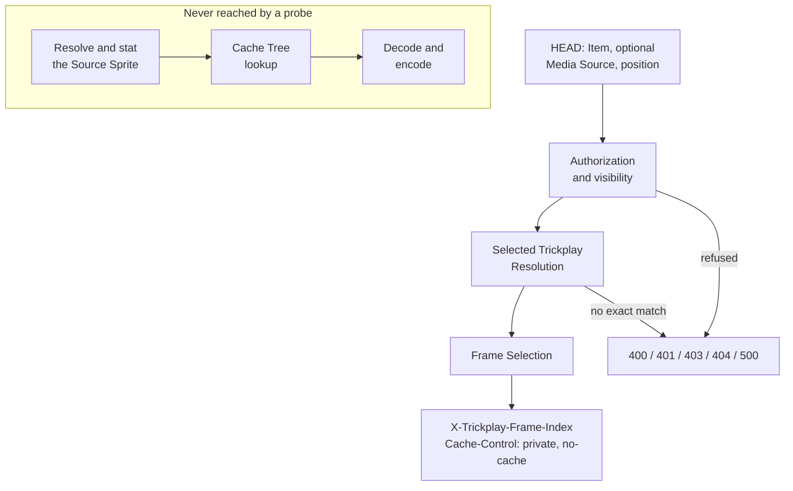

# Trickplay Frame Probe

_Why the isolation is structural rather than disciplined, why a probe carries no ETag,
and why it makes no promise about delivery:
[Probe isolation](../design/probe-isolation.md). This chapter is the mechanism._

## What it is

The HEAD operation that answers *which frame does this position select?* and stops. It
shares the whole front of the pipeline with the preview request — the same authorization
gates, the same Selected Trickplay Resolution, the same Frame Selection — and diverges
the moment a Frame Index exists.

## What it may read

The probe runs the shared pipeline through Frame Selection. That means it reads:

- the caller's identity and the authorization gates,
- the server's current Trickplay Resolution Targets,
- the generated trickplay metadata for the effective Source Video,
- and computes the Frame Index from the position and the generation interval.

## What it must never touch

- It does not **resolve** a Source Sprite path.
- It does not **stat** the sprite file.
- It does not **open** or **snapshot** it.
- It does not reach the **Cache Tree**.
- It does not reach the **encoder**.

This is structural: the probe's path has no route to any of them, rather than a route it
declines to take.

## What it returns

A successful probe has **no body** and carries exactly two headers:

| Header | Value |
|---|---|
| `X-Trickplay-Frame-Index` | the Frame Index this position selects |
| `Cache-Control` | `private, no-cache` |

There is **no ETag**, and the probe has **no conditional behaviour**: an `If-None-Match`
on a probe is not honoured, and a probe never answers `304`.

Failures are the same closed set as the preview request, because the gates are the same:
`400` for a malformed query or a negative position, `401` and `403` for the authorization
gates, `404` for an invisible Item, an unlisted Media Source, no configured target, no
exact metadata match, or no available frames, and `500` for an unreadable or inconsistent
configuration. A probe never fails on a missing sprite file, because it never looks. The
full table is in [the response contract](response-contract.md).

## Where it stops

The probe ends at the Frame Index. The Source Sprite availability gate, the Cache Tree,
and the encoder all lie beyond it, so a successful probe does not establish that the
following preview request can be served.

The detached subgraph is the point of the diagram: those stages exist in the product, and
no probe can arrive at them.

## Anchors

The probe is the `HeadAsync` action on `TrickplayPreviewController`, binding nullable raw
strings so that a malformed identifier becomes a refusal rather than a model binding
error. `TrickplayFrameProbe` implements `ITrickplayFrameProbe` and returns the closed
`TrickplayFrameProbeOutcome` family — a success carrying the Frame Index, plus
`BadRequest`, `Unauthorized`, `Forbidden`, `NotFound`, and `InternalError`, with no
`NotModified`. It resolves its shared front through `JellyfinPreviewContextResolver` and
never takes a lock, writes state, or retries. The contract is recorded normatively in
[the HEAD endpoint research note](../../research/head-endpoint-contract.md).
