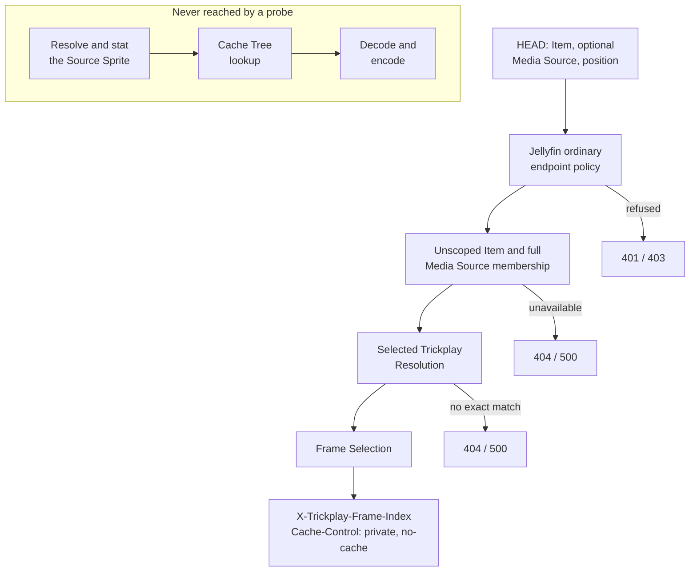

# Trickplay Frame Probe

_Why the isolation is structural rather than disciplined, why a probe carries no ETag,
and why it makes no promise about delivery:
[Probe isolation](../design/probe-isolation.md). This chapter is the mechanism._

## What it is

The HEAD operation that answers *which frame does this position select?* and stops.
Jellyfin's ordinary endpoint authorization policy must accept the request, but the probe
does not resolve a current user or evaluate user visibility or playback policy. It
establishes an actual Item, an actual member Media Source and Source Video, then shares
only the Selected Trickplay Resolution and Frame Selection calculation with GET.

## What it may read

The probe runs its user-independent source path and the shared calculation. It reads:

- the unscoped logical Item and effective Source Video identities,
- the logical Item's full playback Media Source enumeration, without a user and with
  explicit media probing disabled,
- the server's current Trickplay Resolution Targets,
- the generated trickplay metadata for the effective Source Video,
- and computes the Frame Index from the position and the generation interval.

The enumeration retains Jellyfin's supported default, local alternate, linked and
eligible dynamic source forms. The requested GUID must be a member of that enumeration,
the resolved Source Video must have that exact identity, and normalization uses the
matched source's Video Stream width. The pinned host behavior and the limits of the
automated adapter seam are recorded in
[the source-enumeration research note](../../research/jellyfin-10.11.11-frame-probe-source-enumeration-contract.md).

## What it must never touch

- It does not **resolve** a Source Sprite path.
- It does not **stat** the sprite file.
- It does not **open** or **snapshot** it.
- It does not reach the **Cache Tree**.
- It does not reach the **encoder**.

This is structural: the probe's path has no route to any of them, rather than a route it
declines to take.

## What it returns

A successful probe has **no body** and carries exactly two plugin-owned headers:

| Header | Value |
|---|---|
| `X-Trickplay-Frame-Index` | the Frame Index this position selects |
| `Cache-Control` | `private, no-cache` |

There is **no ETag**, and the probe has **no conditional behaviour**: an `If-None-Match`
on a probe is not honoured, and a probe never answers `304`.

`400` represents a malformed query or negative position. `401` or `403` can come from
Jellyfin's ordinary endpoint policy. After that boundary, the probe uses `404` for an
absent Item or Source Video, a non-member source, no Trickplay Resolution Target, no
exact metadata match, or no available frames, and `500` for unreadable or inconsistent
state. It does not conceal by user visibility and never fails on a missing sprite file,
because it evaluates neither. The full table is in
[the response contract](response-contract.md).

## Where it stops

The probe ends at the Frame Index. The Source Sprite availability gate, the Cache Tree,
and the encoder all lie beyond it, so a successful probe does not establish that the
following preview request can be served.

The detached subgraph is the point of the diagram: those stages exist in the product, and
no probe can arrive at them.

## Anchors

The probe is the `HeadAsync` action on `TrickplayPreviewController`, binding nullable raw
strings so that a malformed identifier becomes a refusal rather than a model binding
error. `TrickplayFrameProbe` implements `ITrickplayFrameProbe` and returns the closed
`TrickplayFrameProbeOutcome` family — a success carrying the Frame Index, plus
`BadRequest`, `Unauthorized`, `Forbidden`, `NotFound`, and `InternalError`, with no
`NotModified`. It resolves source facts through
`JellyfinTrickplayFrameProbeContextResolver`; that resolver and the GET-only
`JellyfinPreviewContextResolver` both delegate calculation to
`JellyfinTrickplayFrameCalculationResolver`. It never takes a lock, writes state, or
retries. The HTTP shape is recorded normatively in
[the HEAD endpoint research note](../../research/head-endpoint-contract.md).
