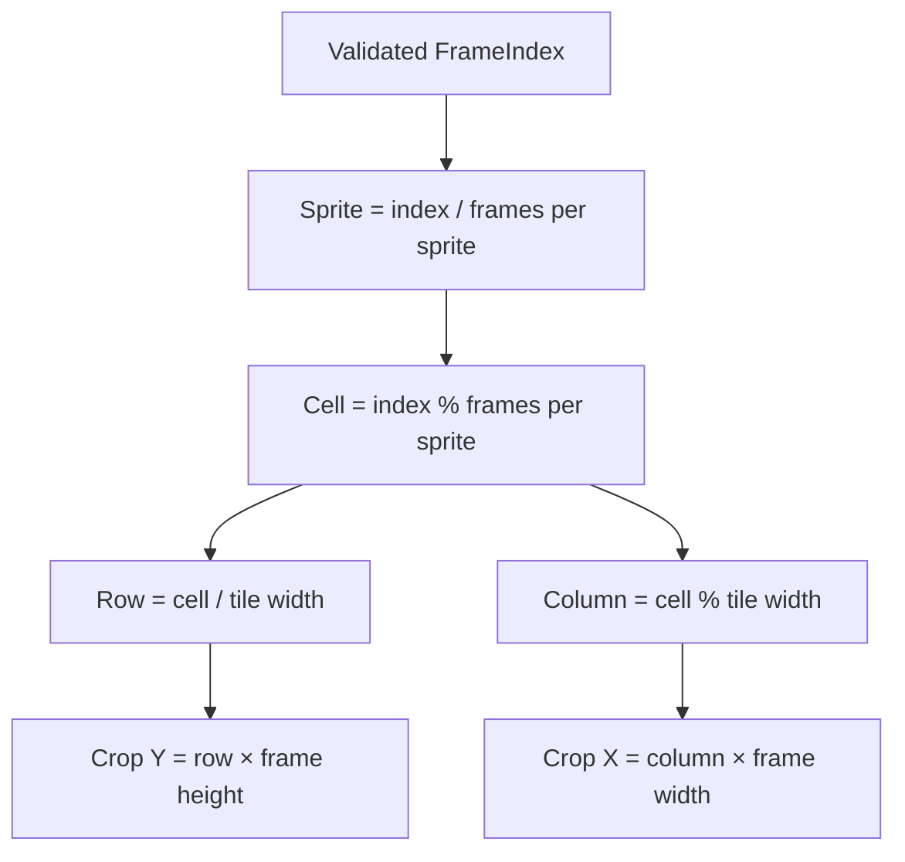

# Frame Selection

_Why direct indexes are bounded rather than clamped, and why checked geometry matters:
[Frame determinism](../design/frame-determinism.md). This chapter is the mechanism._

## Inputs

Preview receives a client-selected zero-based `FrameIndex`. Authoritative generated metadata
supplies the positive thumbnail count and the frame/tile geometry:

| Input | Meaning |
|---|---|
| Frame Index | The requested generated-frame ordinal |
| Thumbnail count | The current upper bound (exclusive) |
| Tile width, tile height | Frames per Source Sprite, as columns and rows |
| Frame width, frame height | Dimensions of one frame inside a Source Sprite |

The server accepts only `0 <= FrameIndex < ThumbnailCount`; negative and upper-out-of-range
values return `400`, with no clamping. Timeline interval data is used by the client for local
playback arithmetic and is not needed by Preview selection.

## Derivation

1. Divide the Frame Index by `TileWidth * TileHeight` to obtain the Source Sprite index and
   the remainder as the cell index.
2. Divide the cell index by `TileWidth` for the row; the remainder is the column.
3. Multiply column by frame width and row by frame height to obtain the crop origin. The crop
   is exactly one frame wide and high.

The arithmetic is checked for overflow and the selected index is validated before Source Sprite
lookup, crop calculation, cache access, conditional comparison, or encoding. Geometry is
recomputed from one metadata row rather than stored as a second source of truth.

Sprites are row-major: cells run left to right, then top to bottom. A tile grid of 4 × 2
therefore maps Frame Index 7 to sprite cell 7, row 1, column 3.

## Anchors

`FrameSelection.Create` performs the direct-index derivation and checked conversion;
`TrickplayMetadata` supplies the generated geometry; `FrameSelectionDiagnostics` and
`InvalidTrickplayMetadataException` carry overflow and consistency failures.
