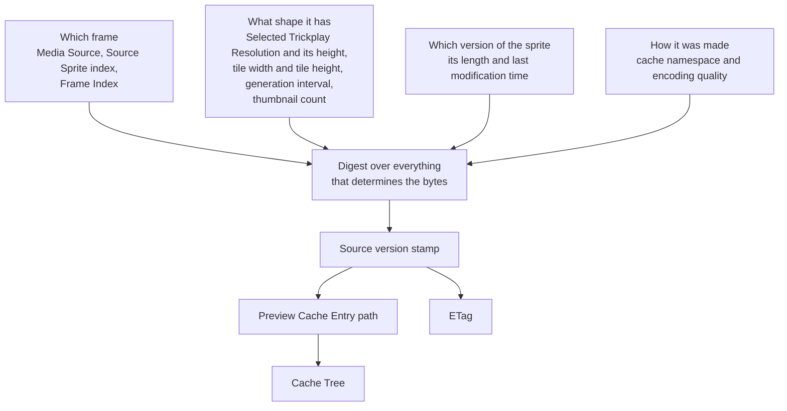

# Preview Cache Entry

_Why identity covers exactly these inputs, and why stale entries are abandoned rather than
invalidated: [Cache identity and freshness](../design/cache-identity-and-freshness.md).
This chapter is the mechanism._

## What makes two previews the same

A **Preview Cache Entry** is the cached representation of one Trickplay Preview. Its
identity is a digest over everything that determines the bytes:

| Input | Why it is part of identity |
|---|---|
| The cache namespace | A change to how entries are laid out abandons the whole tree instead of migrating it |
| The Media Source | Alternate versions of the same video are different videos |
| The Selected Trickplay Resolution, and its matching height | A different width is a different image |
| The generation interval | A different interval means a different position-to-frame mapping |
| The tile width and tile height | Different geometry means a different crop for the same Frame Index |
| The thumbnail count | A different count means a different clamp, so a different final frame |
| The Source Sprite index | A different sprite holds different frames |
| The sprite's version stamp | A replaced sprite holds different pixels at the same coordinates |
| The Frame Index | The frame itself |
| The encoding quality | Two qualities of one frame are two artifacts |

The raw Trickplay Resolution Target is deliberately **not** an input: two targets that
normalize to the same Selected Trickplay Resolution produce identical bytes and must
share one entry, so keying on the raw target would fragment the cache for nothing.

The **source version stamp** is derived from the sprite's length and last modification
time. When the sprite is replaced, the stamp changes, so the identity changes, the entry
path changes, and the ETag changes. Stale entries are not corrected or invalidated; they
become unreachable, and the [scheduled cleanup](scheduled-cleanup.md) removes them.



Four groups of inputs feed one digest, and the stamp it yields feeds both
caller-visible values. That is why no single input can be dropped without making
two different artifacts share an identity.

## What the identity produces

Two caller-visible values come out of it:

- **The ETag**, which combines the source version stamp and the Frame Index.
- **The entry path**, which restates the same inputs as a directory hierarchy.

A conditional request presenting a matching ETag is answered `304` with no body. The full
header and status contract, including the diagnostic `X-Trickplay-Cache` disposition, is
in [the response contract](response-contract.md).

## The Cache Tree layout

The **Cache Tree** is the plugin-owned hierarchy of entries beneath Jellyfin's temporary
storage; the ownership boundary is in [the participants layer](../participants/cache-tree.md).

```text
<temporary storage>/
└── <plugin>/
    └── <cache namespace>/
        └── <media source>/
            └── <frame width>/
                └── <sprite index>-<source version stamp>/
                    └── <frame index>.jpg
```

Each level narrows the identity, so the path is a readable restatement of it: one
directory per Media Source, one per resolution, one per sprite version, and one
file per frame. Numeric components are zero-padded so that lexical order matches
numeric order, which keeps a directory listing meaningful to a person
investigating the tree.

Two properties of the layout are business rules, not conveniences:

- **The sprite version has its own directory level.** Entries from two versions of
  one sprite never share a directory, so a version change cannot collide with, or
  be masked by, the previous version's files.
- **A generation writes to a temporary entry beside the final one, then publishes
  it atomically.** A reader therefore sees either no file or a complete file, never
  a partial one. The rules around that are in
  [Cache coordination](cache-coordination.md).

An empty file is never a valid entry. A zero-length file at an entry path means
something went wrong while it was being written, and it is treated as absent
rather than served.

## Staying inside the tree

Every path the cache reads or writes is re-checked before use: it must remain inside the
Cache Tree, and no component of it may be a reparse point. Both are refused rather than
followed, on every access and not only when an entry is created. What that prevents is in
[concurrency safety](../design/concurrency-safety.md).

## Anchors

`PreviewIdentity` computes the digest, the source version stamp, the ETag, and the
entry path, and owns the namespace and encoding quality constants;
`DiskPreviewCache` owns the Cache Tree, the containment and reparse-point checks,
and the HIT/MISS disposition reported as `PreviewCacheDisposition`.
