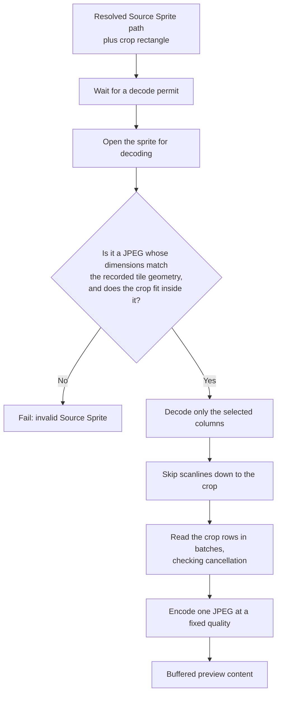

# Preview generation

_Why the sprite's geometry is verified rather than trusted:
[Frame determinism](../design/frame-determinism.md). Why generation waits for a permit,
and what the product deliberately does not cap:
[Resource bounds](../design/resource-bounds.md). This chapter is the mechanism._

## What is being made

A **Trickplay Preview** is one JPEG frame, cropped out of a Source Sprite that
Jellyfin generated. The plugin never creates a sprite, never adds frames to one,
and never repairs one. It reads a rectangle out of an existing file and encodes
that rectangle as a small JPEG.

The rectangle is already known from [Frame Selection](frame-selection.md): its
horizontal offset, its vertical offset, and its size — exactly one frame wide and
one frame high.

## Why only part of the sprite is decoded

A Source Sprite is much larger than one frame. It is a grid of frames, so it is
many frame widths across and many frame heights tall, and it can hold hundreds of
frames. Decoding all of it to extract one frame would make a preview cost more
than the frame is worth, and would do so on every cache miss — which under a scrub
storm is many times a second.

So generation decodes **only the selected columns**. The decoder is told the
horizontal band up front, and writes only those pixels per scanline. Then it skips
scanlines down to the crop's vertical offset, and reads only as many rows as the
crop is tall. Rows are skipped and read in batches, and cancellation is checked
between batches, so a client that has already scrubbed away does not keep a decode
running to completion.

The vertical offset cannot be avoided the same way: JPEG is scanned top to bottom,
so reaching row 40 means passing rows 0 to 39. Passing them without writing their
pixels is what makes this cheap; the horizontal band is what makes it cheap enough.

## What is validated

Three things are checked before any pixel is written:

- **The file is a JPEG with positive dimensions.**
- **The sprite's dimensions equal tile width × frame width by tile height × frame
  height.** This is the load-bearing check: the crop was computed from recorded geometry,
  so a file that does not match it invalidates every offset.
- **The crop lies inside the sprite**, verified independently so that the failure names the
  crop rather than the geometry.

A failure here is an operational failure, not a "frame unavailable" answer: the sprite was
already established to exist. Why that distinction matters to a client, and why the
geometry is checked rather than trusted, is in
[frame determinism](../design/frame-determinism.md).

## The decode permit

Generation waits for one of a small fixed number of **decode permits** before opening a
sprite, and releases it on completion, failure, or cancellation. Waiting is cancellable and
has no timeout, so a client that gives up does not leave a permit consumed.

Why the bound exists, and why it is the only numeric cap the product places on generation,
is in [resource bounds](../design/resource-bounds.md).

## What comes out

One JPEG at a fixed quality. The quality is part of the Preview Cache Entry
identity — see [Preview Cache Entry](preview-cache.md) — because two encodings of
the same frame at different qualities are different artifacts and must not share
an entry.

Generation returns the encoded bytes buffered in memory, not a file handle. The
caller holds the whole response before any lock is released, which is what makes
the coordination rules in [Cache coordination](cache-coordination.md) safe.

## Anchors

`TrickplayPreviewEncoder` owns the permit bound, the validation gates, the subset
scanline decode, and the JPEG encode; `ResolvedPreviewSource` carries the sprite
path and the crop; `PreviewStageException` and `PreviewFailureDetails` carry a
failure without disclosing paths or identifiers. Source Sprites are trusted as
Jellyfin generated them, within the geometry check above; see ADR 0002 under
`docs/adr/`.
