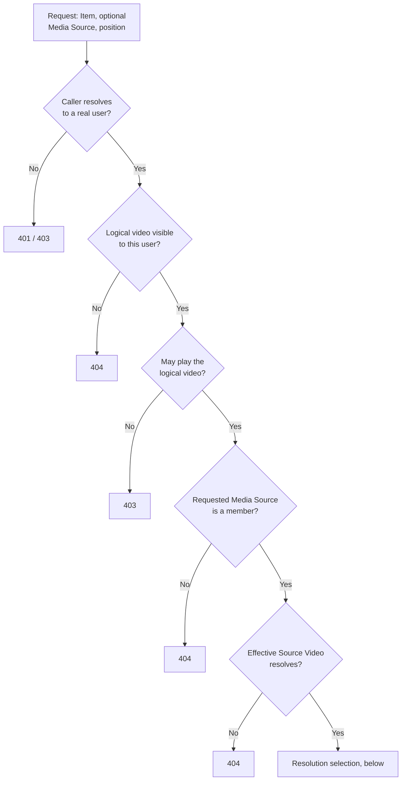
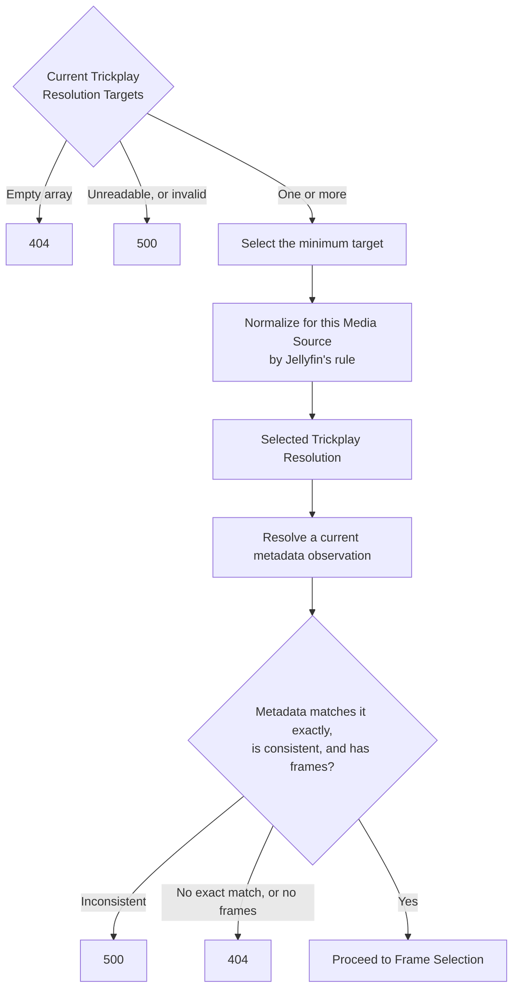

# Source resolution

_Why the visibility gate precedes the playback gate, and why there is no second Source
Video check: [Authorization and visibility](../design/authorization-and-visibility.md).
Why no fallback of any kind is permitted:
[Resolution exactness](../design/resolution-exactness.md). This chapter is the
mechanism._

## The two inputs

A **Trickplay Resolution Target** is a raw frame width in the server's global trickplay
configuration; several may coexist and the set may be empty. **Generated trickplay
metadata** is recorded per Media Source and per recorded width, and is a snapshot of
generation time. The server keeps them deliberately out of step and chooses nothing
between them — see [Jellyfin Server](../participants/jellyfin-server.md) — so the
selection below is the plugin's own policy.

## The two request fronts

Jellyfin's ordinary endpoint authorization policy fronts both operations. After that
boundary, preview and probe intentionally establish different facts before using one
shared resolution and Frame Index calculation.

### GET: user-scoped preview authority

1. **The caller resolves to a real current user.** A server API key is not mapped to an
   implied user and is refused.
2. **The Item is visible to that user.** The logical video is looked up through the
   user-scoped host API, so an Item hidden by library access does not resolve.
3. **The user may play the logical video.** Playback authorization is checked once,
   here, against the logical video.
4. **The requested Media Source belongs to that video.** Membership comes from the
   logical video's user-shaped playback Media Source enumeration.
5. **The effective Source Video is visible.** It is looked up through the user-scoped
   host API and must have the requested identity.

There is **no second playback check** on the Source Video: membership in a logical video
the caller may already play is the authorization. Visibility and existence collapse into
the same GET `404`. These gates finish before GET can return a representation or `304`.

### HEAD: user-independent calculation availability

First consult source facts keyed by logical Item and requested Media Source. A current
positive supplies verified membership, exact identities, and immutable matched-source
width. A current explicit absence ends HEAD with `404`. On a miss or expiry:

1. Resolve the logical video without a user and require its exact requested identity.
2. Ask Jellyfin for the logical video's full playback Media Source enumeration with no
   user, `allowMediaProbe: false`, and path substitution disabled.
3. Require the requested GUID to be a member of that enumeration.
4. Resolve the effective Source Video without a user and require its exact requested
   identity.

The full enumeration retains Jellyfin's default, local alternate, linked and eligible
dynamic sources while disabling explicit media probing. The matched Media Source's Video
Stream width is the normalization input. HEAD performs no current-user resolution,
user-visibility lookup, or playback authorization; its success is not permission evidence.

### Source-fact observation lifetime

Positive membership and matched width live for 30 minutes; explicit user-independent
Item, membership, or Source Video absence lives for 5 minutes. Age begins before the
authoritative logical Item lookup and never slides on HEAD access. Source deletion,
relinking, or width changes may therefore remain invisible to HEAD for the positive's
remaining lifetime. Current configuration targets still apply immediately.

GET always executes its five current user-scoped gates and uses the newly matched width.
Only after those gates succeed does it publish the verified positive source facts, using
that source read's start time and order. It does not publish user-filtered lookup or
membership failure as shared absence. Metadata verification alone never renews source
age; a source publication never renews metadata. Width/configuration errors retain their
existing classification and do not become absence.

Source reads execute independently, including concurrent misses for the same pair.
Older-started results cannot overwrite newer observations. Expired results are rejected
at completion, and retained ordering evidence never makes an expired value servable.
Cancellation is passed to host source enumeration; canceled or failed reads publish no
absence. In-flight registrations remain until their reads settle. Expired idle facts and
empty Item state are reclaimed on access and opportunistically across Items at most once
per 5 minutes. No callback, eager scan, timer, capacity, load limit, queue, or coalescing
is introduced.

| Refusal | GET | HEAD |
|---|---|---|
| Unauthenticated under ordinary endpoint policy | `401` | `401` |
| Ordinary endpoint policy refusal | `403` | `403` |
| No current user, or playback not permitted | `403` | not evaluated |
| Item invisible to the current user | `404` | not evaluated |
| Item, member Media Source, or Source Video identity unavailable | `404` | `404` |

## Choosing one Selected Trickplay Resolution

Once the effective Source Video is known:

1. **Take the minimum current Trickplay Resolution Target.** Several targets are not an
   error. An empty target array means the server generates nothing, so there is nothing
   to serve.
2. **Normalize it with Jellyfin's rule for this Media Source.** The rule itself is
   Jellyfin's, and is recorded where the behaviour comes from:
   [Jellyfin Server](../participants/jellyfin-server.md). The result of applying it here
   is the **Selected Trickplay Resolution** — source-specific, because the rule depends
   on the video.
3. **Resolve one coherent generated-metadata observation.** The recorded metadata for the
   effective Source Video must contain an entry at precisely the Selected Trickplay
   Resolution, with positive height, interval, tile width, tile height, and thumbnail
   count. HEAD may reuse a current observation; GET follows the refresh rules below.

There is **no fallback**: no default width, no alternate target, no nearest resolution,
and no treating recorded metadata as authoritative in place of selection.

| Situation | Outcome |
|---|---|
| Configuration unreadable, or a target normalizes to a non-positive width | `500` — a configuration failure, never a silent substitute |
| No Trickplay Resolution Target configured | `404` |
| Metadata exists but nothing matches the Selected Trickplay Resolution exactly | `404`, with the targets and the recorded widths logged |
| Metadata matches but a frame count is non-positive | `404` |
| Recorded metadata is internally inconsistent for the selected width | `500` — invalid Jellyfin metadata, not a reason to guess another width |

The exact-match rule knowingly refuses data that is servable; why that trade is
deliberate — and what gets logged so the mismatch is diagnosable — is in
[resolution exactness](../design/resolution-exactness.md).

Each request copies the current target array before selection. The copy, normalization
width, position, user and Source Sprite facts never enter metadata identity. Only the
immutable source width is separately retained with its source-fact observation.

## Resolving generated metadata

The metadata module keeps independently validated rows by effective Source Video and exact
Selected Trickplay Resolution. A positive row is current for 30 minutes from the start of
its host read. An empty source dictionary, a missing selected width, or a selected row with
no thumbnails is current for 5 minutes from that same point. HEAD access and Frame Index
calculation do not renew either age.

HEAD consults this state only after the user-independent Item, membership, Source Video,
current target, and normalization steps above. A current positive or applicable negative
answers the metadata step; a miss or expired fact issues a host metadata query.

GET completes all five user-scoped gates and current target selection first. A current
whole-source or selected-width negative then ends GET with `404`, before another metadata
read, Source Sprite path lookup, JPEG access, or conditional success. Otherwise GET always
issues a host metadata query, including when the eventual representation is a Preview Cache
Entry HIT or `304`. It validates and publishes the returned rows, calculates from that same
observation, and gives changed or unchanged checked metadata a new read-start age. This
metadata read does not renew Source Sprite or source-fact age.

An empty dictionary replaces older rows source-wide. Missing-width and no-thumbnail
observations replace only their width; other checked rows remain usable. Invalid selected
metadata removes that retained width and returns `500` without retaining the error. An
operational failure publishes nothing, and neither failure nor an expired negative can fall
back to an older positive. Authorization refusal, Source Sprite absence, and cancellation
are not metadata negatives.

Every host read receives a start order. Reads overlap without same-key coalescing, but an
older-started completion cannot overwrite newer positive or negative state or resurrect a
value removed after newer invalid data. Jellyfin's metadata query cannot be cancelled once
issued; if its caller cancels, the query remains observed through settlement and its result
still follows the same age and publication rules. Expired values and obsolete ordering
state are removed after no in-progress older publication needs them.

For a preview request only, one further gate follows: the Source Sprite for the selected
width and sprite index must actually resolve and exist. Metadata does not prove a file is
on disk. The [Trickplay Frame Probe](frame-probe.md) stops before this gate.

## The decision path

The GET gates, in the order they must run:

Visibility precedes playback, and that order is not rearrangeable. The tables above carry
the exact status for each exit.

Then the selection, which admits no alternative:

## Anchors

`JellyfinPreviewContextResolver` owns GET's user-scoped gates;
`JellyfinTrickplayFrameProbeContextResolver` resolves HEAD's user-independent source facts
through `TrickplaySourceFactsCache`, which also receives independently verified GET
positives and owns source-fact age, ordering, and reclamation.
Both delegate target, metadata, and Frame Index calculation to
`JellyfinTrickplayFrameCalculationResolver`; `TrickplayMetadataCache` owns observation
freshness, scope, ordering, and reclamation. `TrickplayResolutionSelector` implements
the minimum-target choice and Jellyfin's normalization rule; `PreviewQuery` carries the
requested Item, optional Media Source, and position; the closed resolution types carry
only the facts appropriate to each path. `TrickplayMetadata` holds the matched generated
metadata. The GET-only Source Sprite gate that follows is
`JellyfinPreviewSourceResolver` through `IPreviewSourceResolver`. The selection rule and
source-enumeration behavior are recorded normatively in
[the resolution research note](../../research/jellyfin-10.11.11-trickplay-resolution-contract.md)
and [the probe source-enumeration note](../../research/jellyfin-10.11.11-frame-probe-source-enumeration-contract.md).
