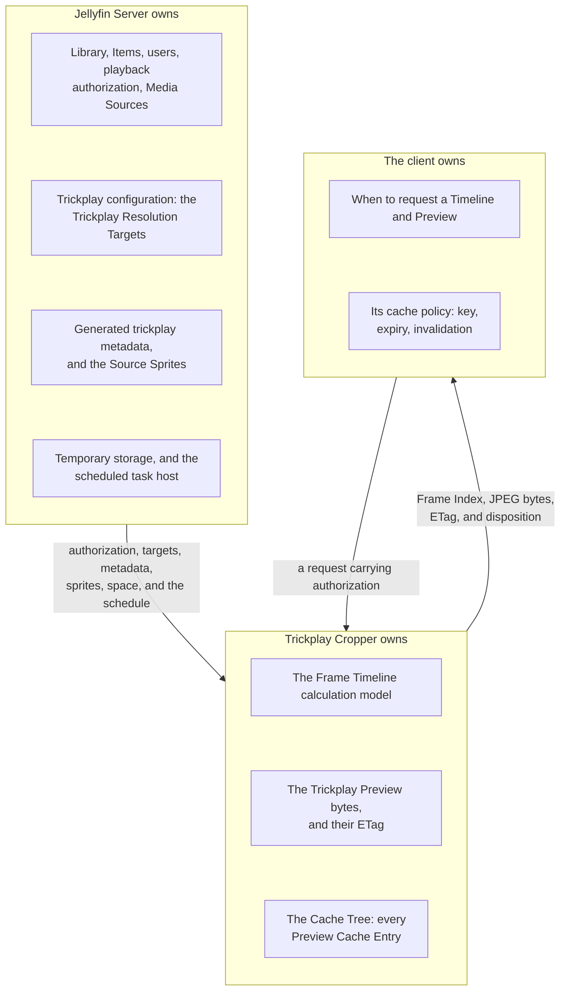

# Participants

Who is in the room, what each one owns, and what crosses the boundaries between
them. This layer states no server-side mechanism: how anything works is in
[the lifecycle layer](../lifecycle/README.md), and why it is shaped that way is in
[the design layer](../design/README.md).

Read this layer first. It is the shortest of the three and the only one that says
who is allowed to change what, which is the fact the other two layers keep
depending on.

## The ownership map

Two lines do most of the work in this product:

- **Jellyfin owns everything durable; Trickplay Cropper owns only what it derived.**
  Every byte the plugin holds can be deleted with no loss but work, and the plugin
  never writes to anything Jellyfin owns.
- **The client owns its cache policy.** The plugin supplies identity and freshness
  and prescribes nothing about how long a client keeps anything.

## The parties

| Party | Chapter | Owns |
|---|---|---|
| The client | [client.md](client.md) | When to ask, and what to do with the answer |
| Jellyfin Server | [jellyfin-server.md](jellyfin-server.md) | The library, the configuration, the generated data, the storage, the schedule |
| The Frame Timeline | [client.md](client.md) | The authorized interval and generated frame count |
| The preview request | [preview-request.md](preview-request.md) | The Trickplay Preview bytes and their identity |
| The Cache Tree | [cache-tree.md](cache-tree.md) | Every derived artifact the plugin holds |
| The cleanup run | [cleanup-task.md](cleanup-task.md) | Deletion inside the Cache Tree, and nothing outside it |

The last four are all Trickplay Cropper, split by the boundary each one faces: the
Timeline and the preview request face the client, the Cache Tree faces the server's
temporary storage, and the cleanup run faces both.

## What this layer deliberately does not say

Full server-side ordering, locks, statuses, or arithmetic do not appear here. A caller-visible
API exchange may show the minimum coordination boundary needed to clarify a participant's
interaction; a reader who wants the complete request mechanism goes to
[the lifecycle layer](../lifecycle/README.md), and a reader who wants to know why the rules are
what they are goes to the [design layer](../design/README.md).
