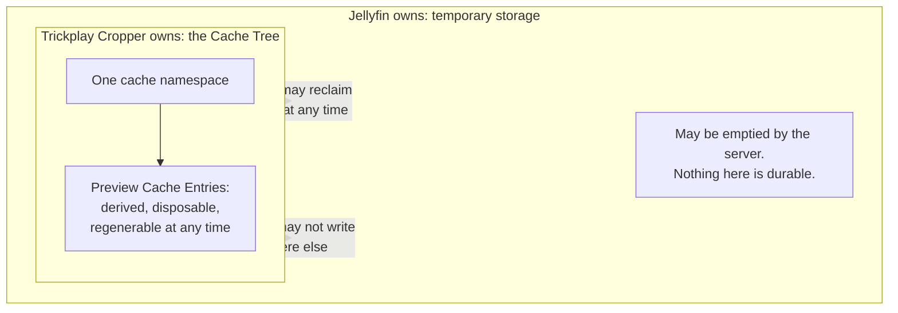

# The Cache Tree

Not a party with intentions, but a resource with a boundary — and the boundary is
the reason it gets a chapter. The Cache Tree is plugin-owned storage living inside
server-owned space.

## Owned by the plugin

Every Preview Cache Entry, the namespace they live under, the layout of the tree,
and the rules for sharing it between concurrent callers. The identity of an entry —
what makes two previews the same — is the plugin's decision and nobody else's:
[preview cache](../lifecycle/preview-cache.md).

## Owned by the server

The space. Temporary storage is not a promise of persistence, and the plugin treats
the whole tree as reclaimable at any moment by someone else. Nothing in the product
depends on an entry surviving, which is why a cache miss costs work and never
correctness.

## The boundary rules

- **The plugin writes nowhere else.** Not into the library, not into Jellyfin's own
  trickplay directories, not into configuration. Everything it creates is inside one
  namespace under temporary storage.
- **Nothing Jellyfin owns ever enters the tree.** A Source Sprite is read where it
  lies; only the cropped frame is copied in.
- **A path that leaves the tree is refused, not followed.** Including by way of a
  reparse point planted inside it. What that protects against is in
  [concurrency safety](../design/concurrency-safety.md) and stated as a rule in
  [the entry layout](../lifecycle/preview-cache.md).
- **Deletion inside the tree is ordinary.** Any entry may be removed at any time by
  [the cleanup run](cleanup-task.md), and a request in flight is protected by rules
  the run follows rather than by the entry being special.

## Faces

The preview request, which reads and writes entries, and the cleanup run, which
removes them. The two meet under lock, and how they meet is the subject of
[cache coordination](../lifecycle/cache-coordination.md).
