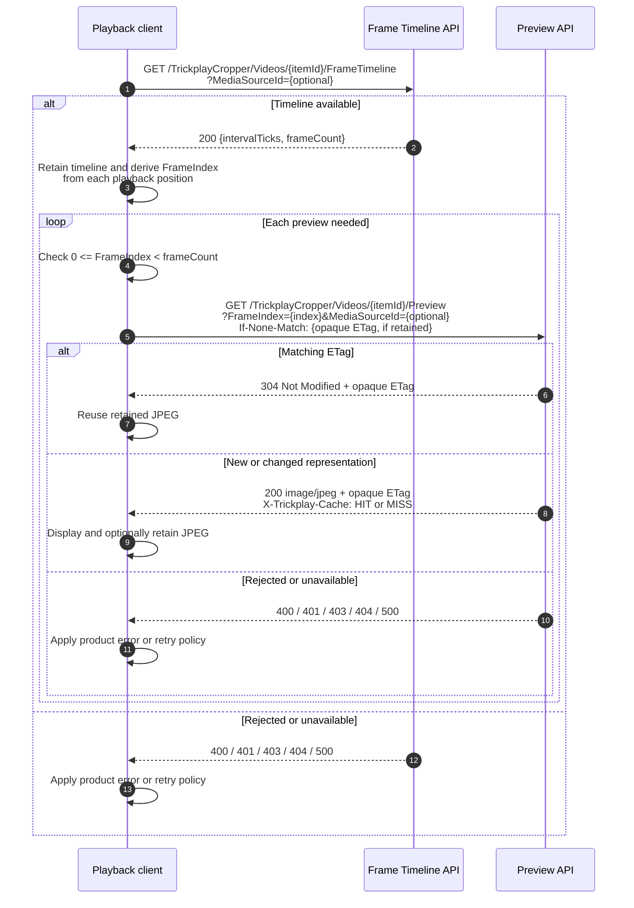

# The client

The playback client owns the per-playback interaction. It requests one authenticated Frame
Timeline for the selected logical Item and Media Source, retains its interval and frame count,
calculates zero-based Frame Index values locally, and requests each Preview directly.

## Caller-visible API call sequence

This boundary view shows how the client uses the two API operations; the server-side request
mechanism remains in the [lifecycle chapters](../lifecycle/README.md). The client obtains the
current timeline before requesting previews. It may send an opaque ETag from a retained JPEG on
a later Preview request, but retained state never replaces the server's checks.

## Owns

- Timeline retention and playback-position arithmetic.
- Choosing when to request a Preview and whether to retain its JPEG locally.
- Treating `frameCount` as an exclusive bound: valid indexes are `0` through
  `frameCount - 1`.
- Handling `400`, `401`, `403`, `404`, and `500` according to the client's product needs.

## May rely on

- Timeline success returns exactly `intervalTicks` and `frameCount` for the authorized source.
- Preview accepts a valid direct Frame Index and returns a JPEG or a bodyless conditional `304`.
- The server rechecks authorization and current metadata on every request.

## Must not assume

- A retained Timeline authorizes later requests or remains current after server changes.
- A valid Timeline proves the Source Sprite exists.
- Interval or frame count changes are a representation version; public ETags are opaque.
- The server clamps an invalid index or derives one from a playback position.

The client is the only participant that turns playback position into a Frame Index. Server-side
authorization, source selection, crop, cache, and encoding remain plugin responsibilities.
