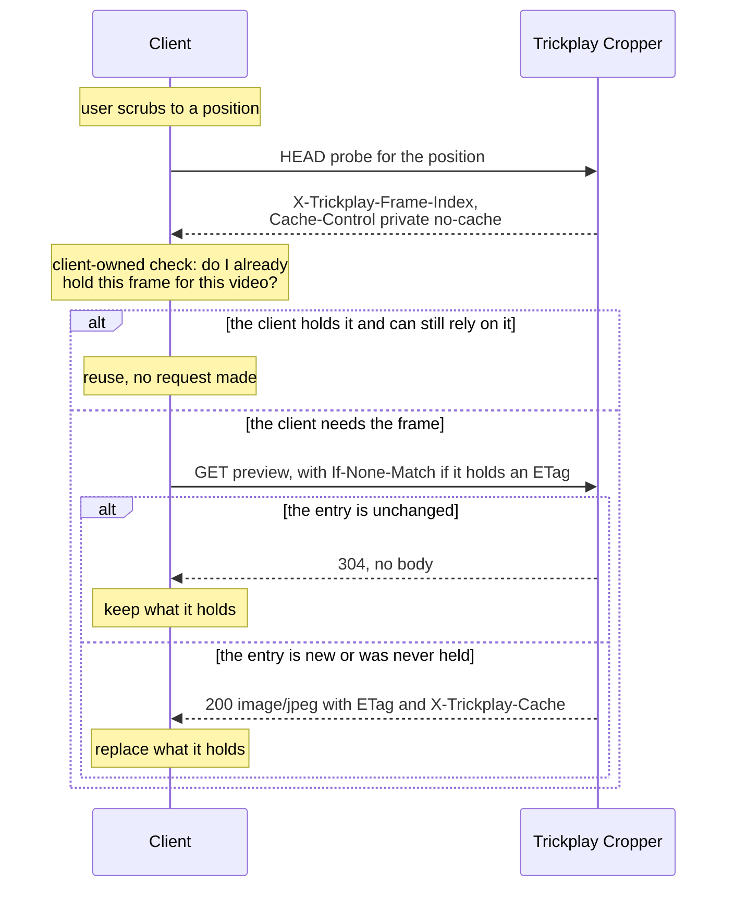

# The client

## Owns

- **When to ask.** Nothing in the product requires a client to probe before
  requesting a preview, or to request one at all. A client may use the Trickplay
  Frame Probe, the preview request, both, or neither.
- **Its cache policy.** Which frames to keep, how to key them, when to drop them,
  and when to revalidate are the client's decisions. The plugin supplies identity
  and freshness and prescribes no key, no expiry, and no invalidation rule.
- **Its scrub behaviour.** How many positions it asks about while a user drags a
  timeline is a client choice, and the product is shaped to make asking cheap
  rather than to forbid asking.

## May assume

- A probe is cheap enough to ask on every scrub movement. What makes it cheap is
  in [the probe's isolation](../design/probe-isolation.md).
- The ETag identifies bytes, and changes when the bytes would change. Reusing a
  held frame is safe exactly as long as its ETag still matches.
- `X-Trickplay-Frame-Index` is stable for a position, so a client may key its own
  storage by frame rather than by position and reuse across small scrub movements.
- Every refusal is one of the statuses in
  [the response contract](../lifecycle/response-contract.md), and `404` conceals
  whether an Item is hidden or absent.

## Must not assume

- **That a successful probe predicts a successful preview.** The probe stops before
  the Source Sprite availability gate, so a `200` probe can be followed by a `404`
  preview for the same position. Why the product accepts this is in
  [probe isolation](../design/probe-isolation.md).
- **That `X-Trickplay-Cache` means anything contractual.** It reports whether the
  bytes were reused or generated. It is diagnostic; a client must not branch on it.
- **That a held frame survives server-side regeneration.** Regenerated trickplay
  data changes the ETag, and the client's copy becomes unverifiable rather than
  wrong. See [cache identity](../design/cache-identity-and-freshness.md).

## The conversation

The decision in the middle belongs to the client and to nobody else. Everything
before it is one cheap question; everything after it is one request whose cost the
plugin bounds — see [decode permits](../lifecycle/preview-generation.md).

## Carries

Authorization for every request. The plugin has no notion of an anonymous caller,
and a server API key is not a substitute for a user: see
[authorization and visibility](../design/authorization-and-visibility.md).
