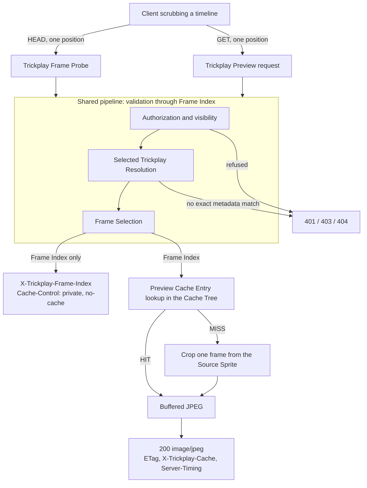

# Business logic

> **Prototype draft.** This file and its siblings are a throwaway draft of what
> would land as `docs/business/`. See [the prototype README](../README.md).

Trickplay Cropper is a Jellyfin server plugin that serves one JPEG frame of a
video for an authorized playback position, cropped from trickplay data that
Jellyfin already generated.

Two operations share one pipeline:

- The **Trickplay Frame Probe** answers *which frame does this position select?*
  It reads configuration and metadata, computes a Frame Index, and stops. It
  never touches an image.
- The **Trickplay Preview** request answers *give me that frame.* It runs the
  same pipeline, then looks the frame up in the Cache Tree and crops it from a
  Source Sprite if it is not there.

Everything the plugin serves is derived and disposable. Jellyfin owns the
library, the trickplay configuration, the generated trickplay metadata, and the
Source Sprites; Trickplay Cropper consumes them and never generates, modifies,
or repairs them.

## The lifecycle

The two operations diverge only after Frame Selection. Everything before it —
who is asking, whether they may play this video, which resolution applies, which
frame the position selects — is one path with one set of rules.

## Chapters, in flow order

| Chapter | What it covers |
|---|---|
| [Source resolution](source-resolution.md) | From the server's configured Trickplay Resolution Targets to one exact Selected Trickplay Resolution, and the authorization gates every request passes first |
| [Trickplay Frame Probe](frame-probe.md) | The HEAD operation: what it may read, what it must never touch, what it returns |
| [Frame Selection](frame-selection.md) | Playback position to Frame Index, and Frame Index to sprite, cell, row, column, crop |
| [Preview generation](preview-generation.md) | Cropping one frame out of a Source Sprite, and why only part of the sprite is decoded |
| [Preview Cache Entry](preview-cache.md) | What makes two previews the same, the source version stamp, and the Cache Tree layout |
| [Cache coordination](cache-coordination.md) | Tree leases, entry locks, and the race between two callers generating one frame |
| [Client interaction](client-interaction.md) | The HEAD/cache/GET conversation and the response headers that carry the contract |
| [Scheduled cleanup](scheduled-cleanup.md) | Emptying the Cache Tree without disturbing a live request |

Each chapter opens with the guarantees it upholds, so the set can be read as an
audit as well as a narrative.

## What these chapters do not cover

Tests, build, packaging, GitHub Actions, Release publication, and the plugin
manifest are development operations, not business logic. Installation, update,
and rollback guidance lives in the repository README.
