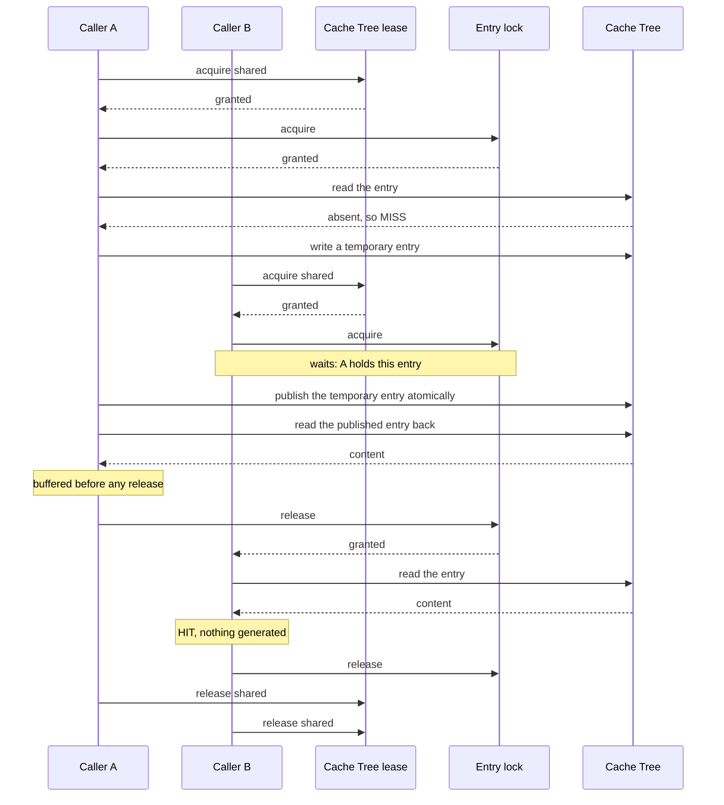
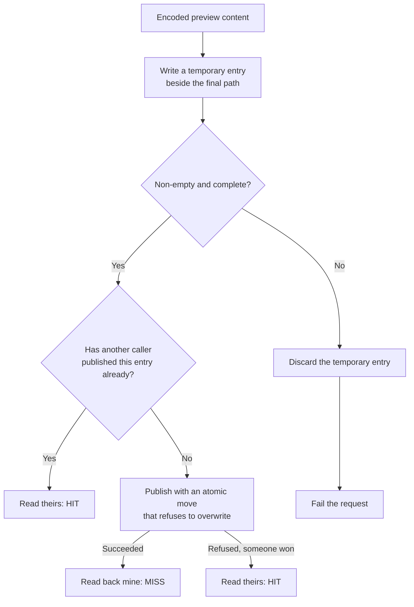

# Cache coordination

**Guarantees this chapter upholds**

- No caller ever reads a partially written entry.
- Two callers asking for the same frame pay for one generation.
- Emptying the Cache Tree never disturbs a request in flight.
- A caller that gives up leaves nothing held behind.

## The problem

One Cache Tree is shared by every concurrent request in the server process, and by
the maintenance run that empties it. Under a scrub storm, many callers ask for
frames of the same video at the same time: some for the same frame, most for
different ones. The coordination has to be cheap in the common case, where callers
are not in each other's way at all, and correct in the rare one, where two of them
want to generate the same entry.

The design deliberately avoids global serialization. Making every request wait its
turn behind one lock would be simple and would turn a preview into a queue. See
ADR 0001.

## Two locks, one order

**The Cache Tree lease** guards the tree as a whole. Requests take it *shared*, so
they do not wait for each other. Only operations that change the tree's shape —
removing an orphaned temporary entry, pruning an empty directory — take it
*exclusively*. The lease is writer-preferred: once a maintenance operation is
waiting, new requests queue behind it rather than streaming past and starving it.

**The entry lock** guards one Preview Cache Entry, keyed by its path. Callers
asking for different frames take different entry locks and never meet. Only
callers asking for the *same* frame contend, and that contention is the point: it
is what makes the second caller reuse the first caller's work.

Every path through the cache takes them in the same order — tree lease, then entry
lock — and releases them in the reverse order. A consistent order is what makes
deadlock impossible between the two, including when a maintenance run holds one
exclusively and requests hold the other shared.

Neither lock has a timeout. Both waits are cancellable, so a caller that
disconnects stops waiting instead of holding a lock it can no longer use.

## The critical detail: buffer before release

The response content is read into memory **before** either lock is released. This
looks like an inefficiency and is the load-bearing rule of the whole design.

Once the entry lock is released, the maintenance run is free to delete that entry:
from its point of view it is an ordinary file older than its cutoff. If the
response still referred to the file rather than to buffered bytes, a request that
had already succeeded could fail while writing its response. Buffering first means
a released entry is nobody's problem any more.

Caller B waited, and waiting was the correct outcome: it turned a second decode of
the same frame into a read.

## The publication race

Generation does not write directly to the entry path. It writes to a **temporary
entry** beside it, created so that no two writers can share one, then publishes it
with an atomic move that refuses to overwrite.

That refusal is the whole cross-process story. Two server processes, or two
requests that somehow escaped the in-process lock, may both generate the same
frame. Whichever move lands first wins; the loser's move fails, and the loser
**reads the winner's entry and reports a hit**. Losing the race is not an error and
is not retried — both writers produced equivalent bytes, and the tree ends up with
exactly one entry.

The temporary entry is always removed, whichever branch ran, so a failed or
cancelled generation does not litter the tree. A temporary entry that survives
anyway — a process killed mid-write — is an orphan, and only the maintenance run
may remove it, under an exclusive tree lease.

## What is observable

A caller sees coordination only through `Server-Timing`, which reports how long the
lookup, cache, decode, and encode stages took. A wait shows up there as time, not
as a named event.

For diagnosis on the server, the waits themselves are observable at Debug level:
the cache disposition, how long a caller waited for an entry lock and whether it
ended up owning it, how long it waited for a Cache Tree lease, and how long it
waited for a decode permit, together with the Frame Index and sprite index it was
working on. Which of these a request actually waited on is the difference between
"the cache is contended" and "the encoder is saturated", and the two have opposite
remedies. The placement of that instrumentation is an implementation decision.

## Anchors

`PreviewCacheCoordination` owns the acquisition order and both locks;
`CacheTreeLock` is the writer-preferred shared/exclusive tree lease;
`PreviewEntryLockRegistry` is the reference-counted per-path entry lock, which
discards a lock nobody is waiting on; the decode permit bound lives in
`TrickplayPreviewEncoder`. `PreviewCacheCheckpoint` names the boundaries above and
is observed by tests only. ADR 0001 records why this is not global serialization.
