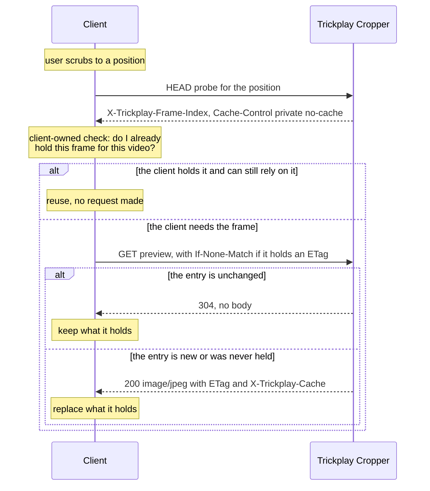

# Client interaction

**Guarantees this chapter upholds**

- A client can always tell whether it may reuse what it already holds.
- The plugin supplies identity and freshness, and prescribes no client cache
  lifetime.
- Every refusal says as little as it can about why.

## The conversation

Two operations, and a client may use either, both, or neither.

The **Trickplay Frame Probe** is the cheap question: *which frame does this
position select?* It is safe to ask on every scrub movement, because it costs no
image work.

The **Trickplay Preview** request is the expensive answer: *give me that frame.*
It may generate one, so a client that asks for every position it passes through
will make the server decode far more frames than anyone will look at.

Between the two sits a decision the plugin does not make: whether the client
already holds the frame it is about to ask for.

## The cache check belongs to the client

The plugin gives a client everything it needs to decide, and makes **no** decision
for it. It does not prescribe a cache key, an expiry, an eviction rule, or an
invalidation policy, and it does not express a preference about how many frames a
client should hold.

What the plugin does supply:

- **Identity.** The ETag is derived from the source version stamp and the Frame
  Index, so it changes when the underlying sprite is replaced and differs between
  frames. It is the only value that reliably says "these bytes".
- **Freshness.** A conditional request presenting a still-valid ETag is answered
  `304` with no body, so a client that holds a frame can confirm it cheaply.
- **A hint about the frame.** `X-Trickplay-Frame-Index` lets a client key its own
  storage by frame rather than by position, so scrubbing back to a slightly
  different position in the same frame reuses what it holds.

`Cache-Control: private, no-cache` is the one instruction the plugin does give,
and it is about *shared* caches, not the client: the answer depends on who asked,
so an intermediary must not hold it, and must revalidate rather than serve. What a
client does in its own memory is its business.

## Headers

| Operation | Response | Headers |
|---|---|---|
| Probe | `200`, no body | `X-Trickplay-Frame-Index`, `Cache-Control: private, no-cache` |
| Preview | `200`, JPEG body | `Content-Type: image/jpeg`, `Content-Disposition: inline`, `Content-Length`, `ETag`, `Cache-Control: private, no-cache`, `X-Trickplay-Cache: HIT` or `MISS`, `Server-Timing` |
| Preview | `304`, no body | `ETag`, `Cache-Control: private, no-cache`, `Server-Timing` |

The probe carries no ETag and honours no `If-None-Match`; it has looked at no
bytes, so it has nothing to identify and nothing to revalidate. The preview
operation honours `If-None-Match`, including the `*` form, and compares weakly.

`X-Trickplay-Cache` reports whether the bytes were reused or generated. It is
diagnostic. A client must not branch on it, and no promise is made about which
requests hit.

`Server-Timing` reports the lookup stage always, and the cache, decode, and encode
stages when they ran, each with its duration in milliseconds. It is the only
caller-visible trace of coordination, so a slow preview can be attributed to a
stage without server access.

`Content-Disposition: inline` states that the body is the image itself, not an
attachment.

## Status codes

Both operations share the same refusals, because they share the same gates. Only
the preview operation can fail on a missing sprite, because only it looks.

| Status | Meaning | Probe | Preview |
|---|---|---|---|
| `200` | Answered | yes, headers only | yes, JPEG body |
| `304` | The caller's ETag still matches | no | yes |
| `400` | Negative playback position | yes | yes |
| `401` | Unauthenticated caller | yes | yes |
| `403` | Server API key caller, or playback not permitted | yes | yes |
| `404` | Item invisible or absent, Media Source not a member, no configured target, no exact metadata match, no available frames | yes | yes |
| `404` | Source Sprite unavailable | no | yes |
| `500` | Configuration unreadable or inconsistent, invalid recorded metadata, or an operational failure during generation | yes | yes |

Two things a client should not infer from this table:

- **`404` conceals.** An Item hidden by library access and an Item that does not
  exist are the same response, on purpose.
- **A successful probe does not predict a successful preview.** The probe stops
  before the sprite availability gate, so the `404` in the second-to-last row can
  follow a `200` probe for the same position. See
  [Trickplay Frame Probe](frame-probe.md).

## Anchors

`TrickplayPreviewController` carries both actions and maps outcomes to statuses
and headers; `PreviewQueryParameters` binds the optional Media Source and the
required position, with the probe binding nullable raw values so a malformed
identifier is refused rather than mis-bound; `PreviewOutcome` is the closed set
behind the table above; `PreviewTelemetry` feeds `Server-Timing`.
