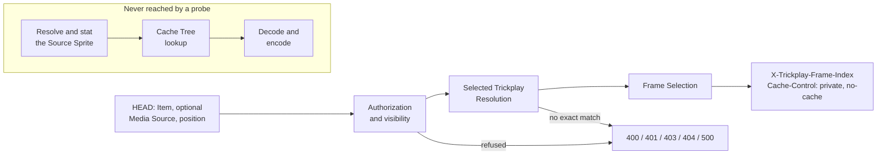

# Trickplay Frame Probe

**Guarantees this chapter upholds**

- Asking which frame a position selects never costs image work.
- A probe answer never promises that the frame can be delivered.
- The probe discloses nothing about the image itself.

## What it is for

A client scrubbing a timeline asks the same question hundreds of times a minute:
*which frame is this position?* The answer is arithmetic over configuration and
generated metadata. It needs no image, no cache lookup, and no disk access beyond
reading metadata the server already holds.

The **Trickplay Frame Probe** is the HEAD operation that answers exactly that
question and stops. It shares the whole front of the pipeline with the preview
request — the same authorization gates, the same Selected Trickplay Resolution,
the same Frame Selection — and diverges the moment a Frame Index exists.

## What it may read

The probe runs the shared pipeline through Frame Selection. That means it reads:

- the caller's identity and the authorization gates,
- the server's current Trickplay Resolution Targets,
- the generated trickplay metadata for the effective Source Video,
- and computes the Frame Index from the position and the generation interval.

## What it must never touch

- It does not **resolve** a Source Sprite path.
- It does not **stat** the sprite file.
- It does not **open** or **snapshot** it.
- It does not reach the **Cache Tree**.
- It does not reach the **encoder**.

This is a structural property, not a best effort: the probe's code path has no
route to any of them. The consequence is that a probe cannot be made slow by a
cold cache, a busy disk, a large sprite, or a scrub storm — and cannot contribute
to any of those problems either.

## What it returns

A successful probe has **no body** and carries exactly two headers:

| Header | Value |
|---|---|
| `X-Trickplay-Frame-Index` | the Frame Index this position selects |
| `Cache-Control` | `private, no-cache` |

There is **no ETag**, and the probe has **no conditional behavior**: an
`If-None-Match` on a probe is not honoured, and a probe never answers `304`. An
ETag describes image bytes, and the probe has not looked at any; disclosing one
would claim knowledge the operation deliberately refuses to acquire.
`Cache-Control: private, no-cache` keeps a shared cache from holding an answer
that depends on who asked.

Failures are the same closed set as the preview request, because the gates are the
same: `400` for a negative position, `401` and `403` for the authorization gates,
`404` for an invisible Item, an unlisted Media Source, no configured target, no
exact metadata match, or no available frames, and `500` for an unreadable or
inconsistent configuration. A probe that would have failed on a missing sprite
file simply does not fail — it never looked.

## The trap this chapter exists to state

**A successful probe is not proof that the following preview request can be
served.** The probe stops before the Source Sprite availability gate. Recorded
metadata can exist while the sprite file does not, and the metadata can be stale
with respect to the files on disk. A client that probes and then requests must
still handle a `404` from the preview request. The probe narrows the question to
"which frame", and deliberately does not answer "is it there".

## Where the pipeline stops

The detached subgraph is the point of the diagram: those stages exist in the
product, and no probe can arrive at them.

## Anchors

The probe is a distinct action on `TrickplayPreviewController`, binding nullable
raw strings so that a malformed identifier becomes a refusal rather than a model
binding error. Its service returns a Frame Index and nothing else; the shared
front of the pipeline is the same `TrickplayPreview` path the preview request
uses, truncated after `FrameSelection`. The contract is recorded normatively in
the HEAD endpoint research note under `docs/research/`.
