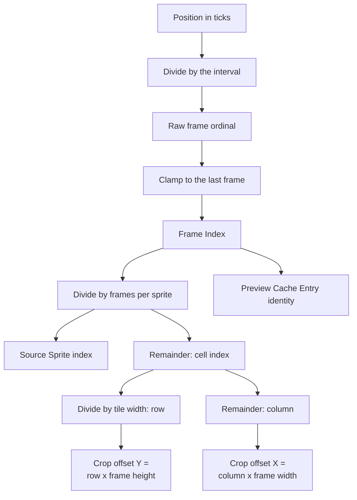
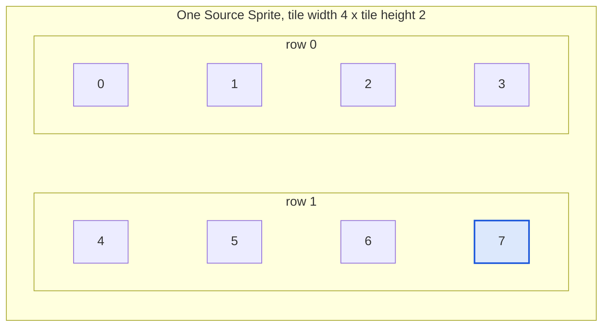

# Frame Selection

**Guarantees this chapter upholds**

- The same playback position always selects the same frame.
- No playback position is out of range.
- The crop rectangle is derived from generated geometry, never assumed.

## The inputs

Frame Selection is pure arithmetic over five values recorded when Jellyfin
generated the trickplay data, plus the requested position:

| Input | Meaning |
|---|---|
| Position | where playback is, in ticks |
| Interval | the gap between generated frames, in milliseconds |
| Thumbnail count | how many frames were generated in total |
| Tile width, tile height | how many frames sit in one Source Sprite, as columns and rows |
| Frame width, frame height | the size of one frame inside a sprite, which is the Selected Trickplay Resolution and its matching height |

All five recorded values must be positive. If any is not, the metadata does not
describe a usable sequence and the request fails as invalid Jellyfin metadata
rather than being estimated around.

## The derivation

1. **Position to Frame Index.** Divide the position by the interval expressed in
   ticks. The result is the ordinal of the frame that covers this position.
2. **Clamp to the last frame.** The generated sequence is finite, and the video
   usually runs past the last generated frame — the tail is covered by a partial
   interval, or by nothing at all. Rather than refuse those positions, the Frame
   Index is clamped to the last available frame. Clamping is a business rule, not
   an error path: *the end of a video still has a preview, and it is the last
   one.*
3. **Frame Index to Source Sprite.** One sprite holds tile width × tile height
   frames. Divide the Frame Index by that product to get the sprite, and take the
   remainder as the cell inside it.
4. **Cell to row and column.** Divide the cell by the tile width for the row, and
   take the remainder as the column.
5. **Row and column to crop.** The crop's horizontal offset is the column times
   the frame width; its vertical offset is the row times the frame height. The
   crop is exactly one frame wide and one frame high.

The Frame Index is the value a probe returns and the value that, together with the
sprite's version stamp, identifies a Preview Cache Entry. Steps 3 to 5 are
recomputed per request rather than stored, because they are cheap and because
storing them would create a second source of truth about geometry.

## Reading a Source Sprite

A sprite is a grid of frames, read left to right, top to bottom. Cell numbering
starts at zero in the top-left, so the cell index alone determines both the row
and the column.

With a tile width of four and a tile height of two, one sprite holds eight frames,
and Frame Index 7 is its last cell:

Frame Index 7 therefore selects row 1, column 3, and the crop starts three frame
widths across and one frame height down. Frame Index 8 would fall in the *next*
sprite, cell 0.

Only the selected columns are decoded and only the selected rows are read; see
[Preview generation](preview-generation.md). The geometry above is what makes that
possible, because the crop's horizontal extent is known before any pixel is
touched.

## Why the arithmetic is checked

The derivation multiplies and divides recorded values whose magnitude the plugin
does not control. A tile geometry or thumbnail count large enough to overflow the
arithmetic would produce a plausible-looking but wrong crop, silently. Frame
Selection therefore verifies that every intermediate value fits, and fails the
request with the diagnostics attached if one does not. A wrong frame delivered
confidently is worse than an error.

## Anchors

`FrameSelection` performs the derivation and exposes the Frame Index, sprite
index, cell, row, column, and crop; `TrickplayMetadata` carries the five recorded
inputs; `FrameSelectionDiagnostics` and `InvalidTrickplayMetadataException` carry
the overflow and consistency failures.
