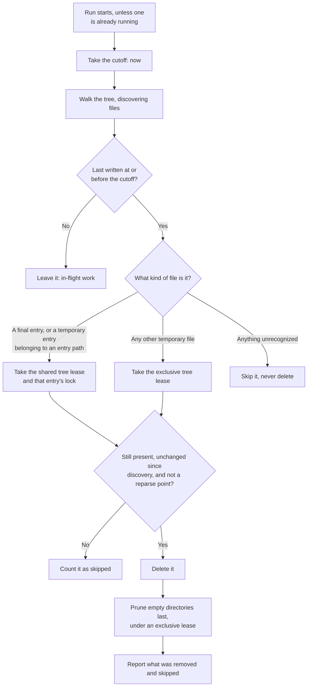

# Scheduled cleanup

_Why the tree needs emptying, what breaks without a careful run, and why the schedule
belongs to the server: [Resource bounds](../design/resource-bounds.md). This chapter is
the mechanism._

## What the run removes

Entries become unreachable without ever becoming invalid. When a sprite's version stamp
changes, when the Selected Trickplay Resolution changes, or when a video leaves the
library, the old entries stay in the tree at paths no future request will compute. Nothing
invalidates them — see [Preview Cache Entry](preview-cache.md) — so the run is what removes
them. Why the design abandons rather than invalidates is in
[resource bounds](../design/resource-bounds.md).

## The run

Cleanup is a Jellyfin scheduled task in the server's Maintenance category, so an
administrator sees it in the task list, can reschedule it, and can run it by hand.
It is not a background timer inside the plugin, and it does not decide its own
cadence. Only one run proceeds at a time; a second trigger while one is running
does not start a parallel run.

The run takes a **cutoff** at the moment it starts, and from then on considers only
files last written at or before that cutoff. Everything written after the run began
is invisible to it, which is the first of two protections for in-flight work: a
request that starts generating during a run cannot have its entry deleted by that
run.

## Classifying a discovered file

The run does not delete "everything old". Each discovered file is classified, and
the classification decides which lock guards its removal:

- **A final entry**, or **a temporary entry belonging to an entry path**, is
  removed under that entry's lock, with the tree lease held shared. Taking the
  entry lock is what makes the removal safe against a request that is mid-generation
  on exactly that entry: such a request holds the lock, so the run waits.
- **Any other temporary file** is an orphan — the residue of a process killed
  between writing and publishing. It belongs to no entry, so no entry lock can guard
  it; it is removed under an *exclusive* tree lease instead, which no request can be
  holding at the same time.
- **Anything unrecognized is skipped.** The run has no opinion about a file it does
  not understand, and no reason to delete one. A tree the plugin shares with a host
  it does not control is not a tree it may tidy by guesswork.

## The second protection: re-check before deleting

Between discovering a file and deleting it, time passes. A file could have been
replaced, or written to, in between. So the run verifies at the moment of deletion
that the file is still present and that its length and modification time are
unchanged since it was captured. A file that changed is not the file that was judged
eligible, so it is counted as skipped and left alone.

Reparse points are warned about and never followed or deleted, for the same reason
the cache refuses them: see [Preview Cache Entry](preview-cache.md).

## Pruning

Deleting entries leaves empty directories — a sprite version directory whose every
frame was removed, a resolution directory whose every sprite was removed. Empty
directories are pruned last, under an exclusive tree lease, so that a directory is
never removed while a request is about to create a file inside it. Pruning is
bottom-up: a parent is only a candidate once its children are gone.

## What the run reports

The run reports how much it removed and how much it skipped, so an administrator can
tell a quiet tree from a tree that keeps changing under it. A high skip count is not
a failure; it means the tree was busy while the run walked it, and the protections
above did their job.

## What cleanup never does

- It never touches Jellyfin-owned trickplay data, Source Sprites, library metadata,
  or media files.
- It never regenerates, repairs, or reclaims anything.
- It never deletes a file it does not recognize, or one it cannot prove unchanged.
- It never runs outside its schedule or an administrator's explicit request.

## Anchors

`ClearTrickplayCropperCacheTask` is the scheduled task and its default trigger;
`DiskPreviewCache` owns the run — the single-run bound, the cutoff, discovery,
candidate classification, the pre-deletion re-check, and directory pruning — through
its maintenance surface `IPreviewCacheMaintenance`.
