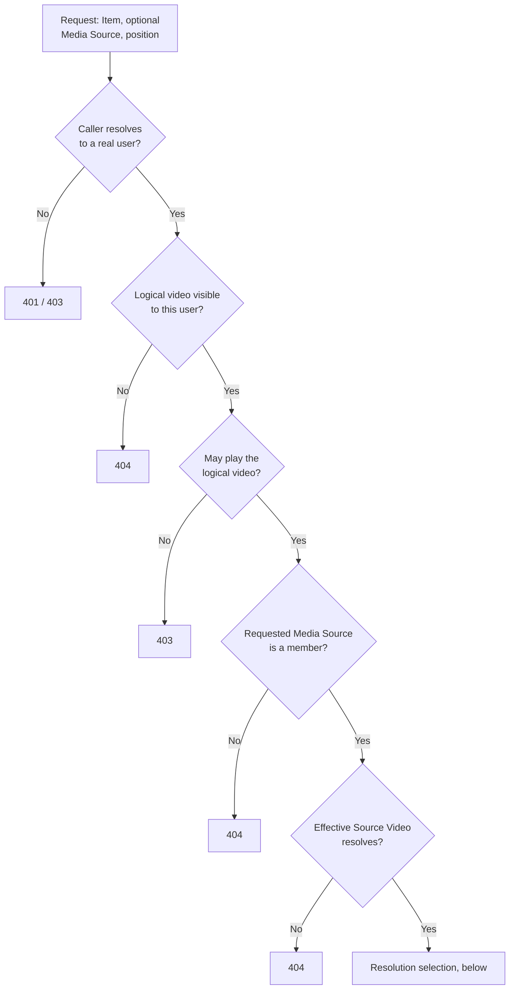
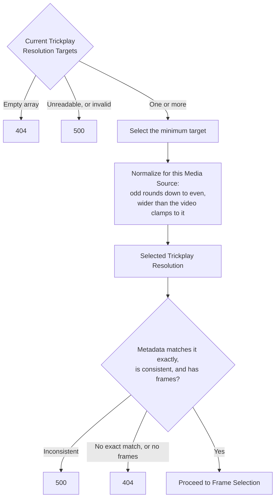

# Source resolution

_Why the visibility gate precedes the playback gate, and why there is no second Source
Video check: [Authorization and visibility](../design/authorization-and-visibility.md).
Why no fallback of any kind is permitted:
[Resolution exactness](../design/resolution-exactness.md). This chapter is the
mechanism._

## The two inputs

A **Trickplay Resolution Target** is a raw frame width in the server's global trickplay
configuration; several may coexist and the set may be empty. **Generated trickplay
metadata** is recorded per Media Source and per recorded width, and is a snapshot of
generation time. The server keeps them deliberately out of step and chooses nothing
between them — see [Jellyfin Server](../participants/jellyfin-server.md) — so the
selection below is the plugin's own policy.

## The authorization gates, in order

Every request — probe and preview alike — passes these before any resolution or frame
work.

1. **The caller is a real user.** An unauthenticated caller is refused. A caller
   presenting a server API key is refused too: an API key is an unscoped administrator
   credential, not a user.
2. **The Item is visible to that user.** The logical video is looked up scoped to the
   calling user, so an Item hidden by library access does not resolve.
3. **The user may play the logical video.** Playback authorization is checked once,
   here, against the logical video.
4. **The requested Media Source belongs to that video.** When no Media Source is named,
   the Item itself is the source. A named source that is not a member of the logical
   video is refused as though it did not exist.
5. **The effective Source Video resolves.** The member source is looked up as a video in
   its own right, because Jellyfin models a local alternate version as its own Source
   Video and records its trickplay data under that Source Video's identity.

There is **no second playback check** on the Source Video: membership in a logical video
the caller may already play is the authorization.

| Refusal | Status |
|---|---|
| Unauthenticated, or API-key caller | `401` / `403` |
| Item invisible to this user, or absent | `404` |
| Playback not permitted | `403` |
| Named Media Source not a member, or does not resolve | `404` |

Visibility and existence collapse into the same `404`.

## Choosing one Selected Trickplay Resolution

Once the effective Source Video is known:

1. **Take the minimum current Trickplay Resolution Target.** Several targets are not an
   error. An empty target array means the server generates nothing, so there is nothing
   to serve.
2. **Normalize it with Jellyfin's rule for this Media Source.** An odd target is rounded
   down to an even width; a target wider than the Source Video is clamped to the video's
   width, also rounded down to even. The result is the **Selected Trickplay Resolution**
   — source-specific, because the clamp depends on the video.
3. **Require the generated metadata to match it exactly.** The recorded metadata for the
   effective Source Video must contain an entry at precisely the Selected Trickplay
   Resolution, with positive height, interval, tile width, tile height, and thumbnail
   count.

There is **no fallback**: no default width, no alternate target, no nearest resolution,
and no treating recorded metadata as authoritative in place of selection.

| Situation | Outcome |
|---|---|
| Configuration unreadable, or a target normalizes to a non-positive width | `500` — a configuration failure, never a silent substitute |
| No Trickplay Resolution Target configured | `404` |
| Metadata exists but nothing matches the Selected Trickplay Resolution exactly | `404`, with the targets and the recorded widths logged |
| Metadata matches but a frame count is non-positive | `404` |
| Recorded metadata is internally inconsistent for the selected width | `500` — invalid Jellyfin metadata, not a reason to guess another width |

The exact-match rule knowingly refuses data that is servable: an odd or oversized target
can leave recorded tiles under a key that differs from the Selected Trickplay Resolution.
The tiles exist and the request still returns `404`, which is why both values are logged.

For a preview request only, one further gate follows: the Source Sprite for the selected
width and sprite index must actually resolve and exist. Metadata does not prove a file is
on disk. The [Trickplay Frame Probe](frame-probe.md) stops before this gate.

## The decision path

The gates, in the order they must run:

Visibility precedes playback, and that order is not rearrangeable. The tables above carry
the exact status for each exit.

Then the selection, which admits no alternative:

## Anchors

`JellyfinPreviewSourceResolver` owns the gates and the selection; `PreviewQuery` carries
the requested Item, optional Media Source, and position; `PreviewSourceResolution` is the
closed set of outcomes above; `TrickplayMetadata` holds the matched generated metadata.
The selection rule and its failure table are recorded normatively in the resolution
research note under `docs/research/`.
