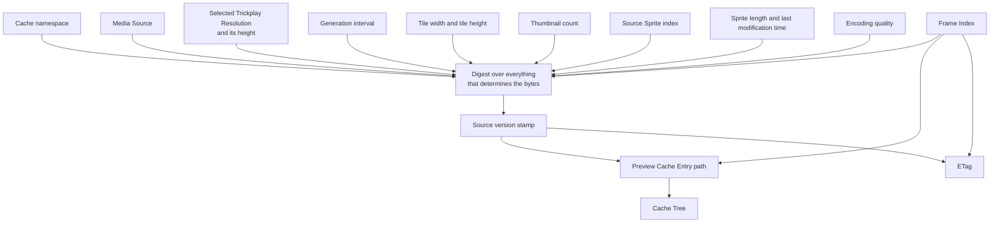

# Preview Cache Entry

**Guarantees this chapter upholds**

- A cached preview is served only while it still belongs to the source version
  that produced it.
- Regenerated trickplay data can never be served stale.
- Two callers asking for the same frame find the same entry.

## What makes two previews the same

A **Preview Cache Entry** is the cached representation of one Trickplay Preview.
The question "is this the same preview?" is not answered by the frame alone: the
same Frame Index from a different sprite, at a different resolution, with a
different tile geometry, or encoded at a different quality is a different
artifact, and serving one in place of the other would be serving a wrong image
confidently.

So the entry's identity is a digest over everything that determines the bytes:

| Input | Why it is part of identity |
|---|---|
| The cache namespace | A change to how entries are laid out abandons the whole tree instead of migrating it |
| The Media Source | Alternate versions of the same video are different videos |
| The Selected Trickplay Resolution, and its matching height | A different width is a different image |
| The generation interval | A different interval means a different position-to-frame mapping |
| The tile width and tile height | Different geometry means a different crop for the same Frame Index |
| The thumbnail count | A different count means a different clamp, so a different final frame |
| The Source Sprite index | A different sprite holds different frames |
| The sprite's version stamp | A replaced sprite holds different pixels at the same coordinates |
| The Frame Index | The frame itself |
| The encoding quality | Two qualities of one frame are two artifacts |

The **source version stamp** is the input that does the most work. Jellyfin may
regenerate trickplay data at any time, replacing a sprite file in place. The
stamp is derived from the sprite's length and last modification time — the
observable evidence of which version of the file the plugin looked at. When the
sprite is replaced, the stamp changes, the identity changes, the entry path
changes, and the ETag changes. Stale entries are not corrected or invalidated;
they become unreachable, and the [scheduled cleanup](scheduled-cleanup.md) removes
them.



Every input feeds one digest, and the stamp it yields feeds both caller-visible
values. That is why no single input can be dropped without making two different
artifacts share an identity.

## What a caller can observe

The identity produces two caller-visible values:

- **The ETag**, which combines the source version stamp and the Frame Index. A
  conditional request presenting a matching ETag is answered `304` with no body.
  Because the stamp is in it, an ETag stops matching the moment the underlying
  sprite is replaced — a client cannot hold a stale frame past a regeneration.
- **`X-Trickplay-Cache: HIT` or `MISS`**, telling the caller whether the bytes
  were reused or generated. This is diagnostic, not contractual: a client must
  not change its behaviour based on it, and the plugin makes no promise about
  which requests hit.

## The Cache Tree

The **Cache Tree** is the plugin-owned hierarchy of entries beneath Jellyfin's
temporary storage. It is a cache in the strict sense: everything in it is derived
from data Jellyfin owns, and deleting any part of it loses nothing but work.

```text
<temporary storage>/
└── <plugin>/
    └── <cache namespace>/
        └── <media source>/
            └── <frame width>/
                └── <sprite index>-<source version stamp>/
                    └── <frame index>.jpg
```

Each level narrows the identity, so the path is a readable restatement of it: one
directory per Media Source, one per resolution, one per sprite version, and one
file per frame. Numeric components are zero-padded so that lexical order matches
numeric order, which keeps a directory listing meaningful to a person
investigating the tree.

Two properties of the layout are business rules, not conveniences:

- **The sprite version has its own directory level.** Entries from two versions of
  one sprite never share a directory, so a version change cannot collide with, or
  be masked by, the previous version's files.
- **A generation writes to a temporary entry beside the final one, then publishes
  it atomically.** A reader therefore sees either no file or a complete file, never
  a partial one. The rules around that are in
  [Cache coordination](cache-coordination.md).

An empty file is never a valid entry. A zero-length file at an entry path means
something went wrong while it was being written, and it is treated as absent
rather than served.

## Staying inside the tree

Every path the cache reads or writes is re-checked before use: it must remain
inside the Cache Tree, and no component of it may be a reparse point. The tree
lives in temporary storage on a host the plugin does not control, and the entry
path is built from values derived from server state. A symbolic link planted in
the tree would otherwise redirect a write outside it, and a crafted identity would
otherwise reach a path that was never an entry. Both are refused rather than
followed.

## Anchors

`PreviewIdentity` computes the digest, the source version stamp, the ETag, and the
entry path, and owns the namespace and encoding quality constants;
`DiskPreviewCache` owns the Cache Tree, the containment and reparse-point checks,
and the HIT/MISS disposition reported as `PreviewCacheDisposition`.
