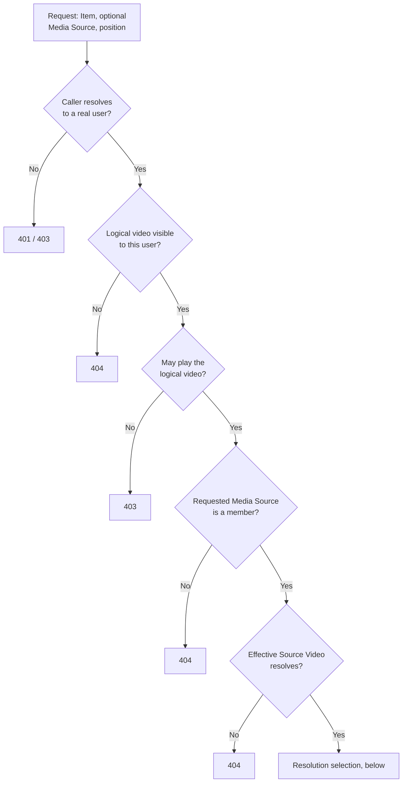
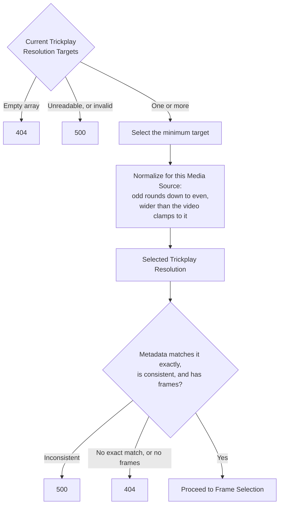

# Source resolution

**Guarantees this chapter upholds**

- A caller receives a frame from a resolution the server was configured to
  produce for that Media Source, exactly — never a substitute.
- An Item the caller cannot see is indistinguishable from an Item that does not
  exist.
- Nothing about an image is decided before the caller is known to be allowed it.

## Why a selection policy is needed at all

Jellyfin holds two unrelated pieces of state, and neither one answers "which
resolution should this request use":

- A **Trickplay Resolution Target** is a raw frame width in the server's global
  trickplay configuration. Several targets may coexist, the array may be empty,
  and it is not per-library or per-item.
- **Generated trickplay metadata** is recorded per Media Source and per recorded
  width. It is a snapshot of generation time: its interval, tile geometry,
  thumbnail count, and height describe what was produced then, not what the
  configuration says now.

The two are deliberately not kept in lockstep. Removing a target does not delete
its recorded metadata; adding one may generate a new row; a target that was odd
or wider than the video can leave recorded data whose key differs from the width
that was requested. Trickplay Cropper therefore owns an explicit rule for
turning the current targets into one usable width.

## The authorization gates, in order

Every request — probe and preview alike — passes these before any resolution or
frame work.

1. **The caller is a real user.** An unauthenticated caller is refused. A caller
   presenting a server API key is refused too: an API key is an unscoped
   administrator credential, and administrator reach is not evidence that a user
   may play this video.
2. **The Item is visible to that user.** The logical video is looked up scoped to
   the calling user, so an Item hidden by library access does not resolve. This
   gate comes before the playback gate on purpose: an invisible Item must not
   reveal why it was refused.
3. **The user may play the logical video.** Playback authorization is checked
   once, here, against the logical video.
4. **The requested Media Source belongs to that video.** When no Media Source is
   named, the Item itself is the source. A named source that is not a member of
   the logical video is refused as though it did not exist.
5. **The effective Source Video resolves.** The member source is looked up as a
   video in its own right, because Jellyfin models a local alternate version as
   its own Source Video and records its trickplay data under that Source Video's
   identity.

There is **no second playback check** on the Source Video. Membership in a
logical video the user may already play is the authorization; repeating the check
would refuse alternate versions whose own access differs from the logical video's
for reasons that have nothing to do with the caller's rights.

| Refusal | Status |
|---|---|
| Unauthenticated, or API-key caller | `401` / `403` |
| Item invisible to this user, or absent | `404` |
| Playback not permitted | `403` |
| Named Media Source not a member, or does not resolve | `404` |

Visibility and existence collapse into the same `404` so that a refused caller
learns nothing about what the library contains.

## Choosing one Selected Trickplay Resolution

Once the effective Source Video is known:

1. **Take the minimum current Trickplay Resolution Target.** Several targets are
   not an error; the smallest is chosen because it is the one every configured
   client can display, and because a stable choice keeps the Preview Cache Entry
   identity stable across requests. An empty target array means the server
   generates nothing, so there is nothing to serve.
2. **Normalize it with Jellyfin's rule for this Media Source.** An odd target is
   rounded down to an even width; a target wider than the Source Video is clamped
   to the video's width, also rounded down to even. The result is the **Selected
   Trickplay Resolution** — source-specific, because the clamp depends on the
   video.
3. **Require the generated metadata to match it exactly.** The recorded metadata
   for the effective Source Video must contain an entry at precisely the Selected
   Trickplay Resolution, with positive height, interval, tile width, tile height,
   and thumbnail count.

There is **no fallback**. No 320 px default, no alternate target, no nearest
resolution. A recorded width that is close but not exact is a different
resolution, and serving it would mean cropping with geometry that does not
describe the sprite being cropped.

| Situation | Outcome |
|---|---|
| Configuration unreadable, or a target normalizes to a non-positive width | `500` — a configuration failure, never a silent substitute |
| No Trickplay Resolution Target configured | `404` |
| Metadata exists but nothing matches the Selected Trickplay Resolution exactly | `404`, with the targets and the recorded widths logged |
| Metadata matches but a frame count is non-positive | `404` |
| Recorded metadata is internally inconsistent for the selected width | `500` — invalid Jellyfin metadata, not a reason to guess another width |

For a preview request only, one further gate follows: the Source Sprite for the
selected width and sprite index must actually resolve and exist. Metadata does not
prove a file is on disk. The [Trickplay Frame Probe](frame-probe.md) stops before
this gate, which is why a successful probe does not promise a deliverable
preview.

## The decision path

The gates, in the order they must run:

Visibility precedes playback on purpose: an invisible Item must not reveal why it
was refused. The tables above carry the exact status for each exit.

Then the selection, which admits no alternative:

The `500` exits exist so that a broken configuration fails loudly instead of being
papered over by a substitute width.

## Anchors

`JellyfinPreviewSourceResolver` owns the gates and the selection; `PreviewQuery`
carries the requested Item, optional Media Source, and position;
`PreviewSourceResolution` is the closed set of outcomes above;
`TrickplayMetadata` holds the matched generated metadata. The selection rule and
its failure table are recorded normatively in the resolution research note under
`docs/research/`.
